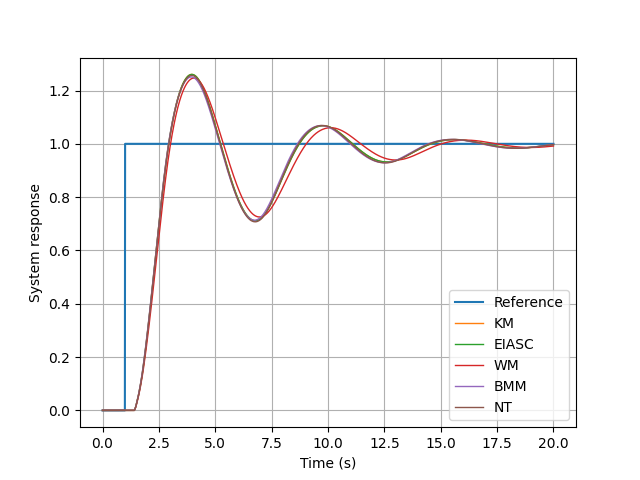
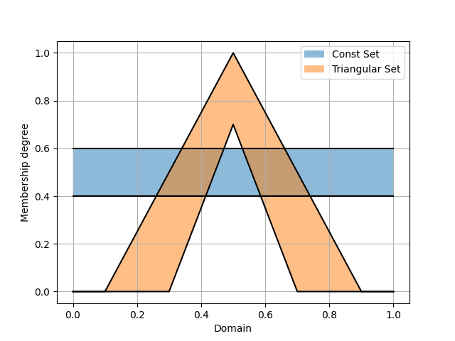
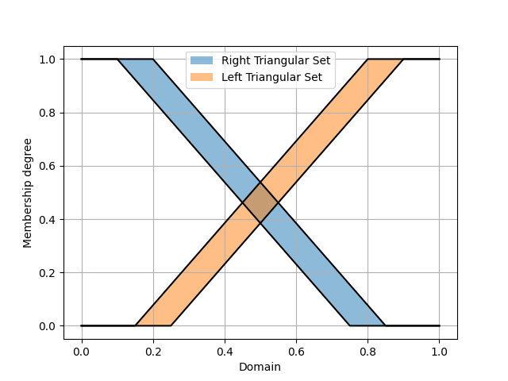
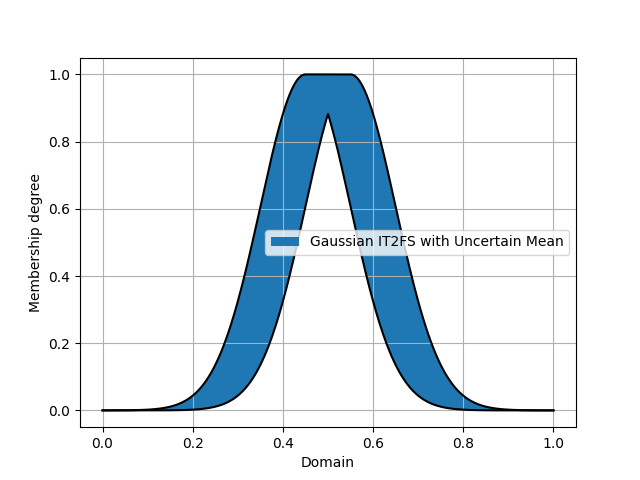
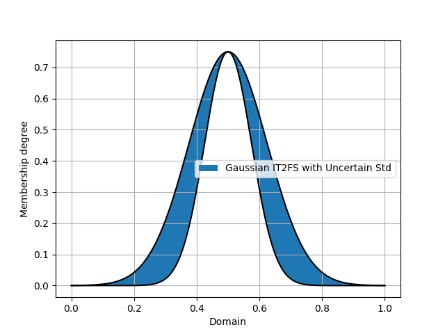
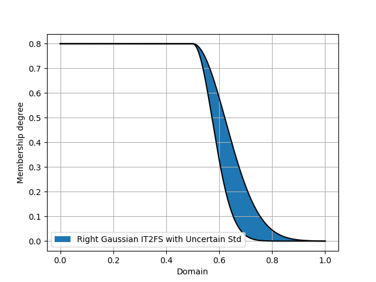
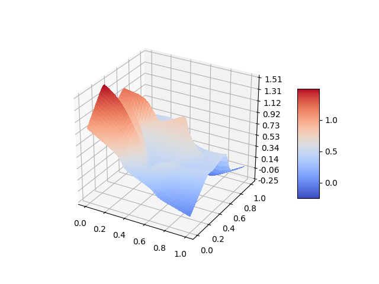

PyIT2FLS
========


NumPy based toolkit for Interval Type 2 Fuzzy Logic Systems (IT2FLS) simulation.

## Licence
PyIT2FLS is published under MIT license. If you are using the developed toolkit, please cite preprint of our paper [PyIT2FLS: A New Python Toolkit for Interval Type 2 Fuzzy Logic Systems](https://arxiv.org/abs/1909.10051).

    @misc{haghrah2019pyit2fls,
        title={PyIT2FLS: A New Python Toolkit for Interval Type 2 Fuzzy Logic Systems},
        author={Amir Arslan Haghrah and Sehraneh Ghaemi},
        year={2019},
        eprint={1909.10051},
        archivePrefix={arXiv},
        primaryClass={eess.SY}
    }

## Installation
PyIT2FLS can be installed by unzipping the source code in a directory and using this command:

    (sudo) python3 setup.py install

Or you can use pip3:

    (sudo) pip3 install --upgrade pyit2fls

## Versions

### Features coming up in the version 0.5
- [ ] Supporting both Mamdani and TSK systems.
- [ ] Correcting a bug, which makes it impossible to use different domains for the inputs of a FLS.

### Some notes on version 0.4
 * Some bugs have been fixed in this version especially in type reduction algorithms. I would like to say thanks to Dr. K.B Badri Narayanan for reporting the errors.
 * Some new IT2FSs are added to the toolkit.
 * In previous versions, the height of the IT2FS_Gaussian_UncertStd and IT2FS_Gaussian_UncertMean IT2FSs was fixed to 1, by default. But in the new version, user must give the height value in the parameters list as the last element.

## Docstrings
Further information about functions and classes in the PyIT2FLS are accessible by docstrings. After importing a function or class, they can be seen by calling the help function. For example:

```python
>>> from pyit2fls import IT2FS_Gaussian_UncertStd
>>> help(IT2FS_Gaussian_UncertStd)
```

## Examples
There are some examples provided along with the toolkit which are as below:
* Ex1: Defining an Interval Type 2 Fuzzy Set (IT2FS).
* Ex2: Application of join and meet operators and plotting the outputs.
* Ex3: Defining a simple (MIMO) IT2FLS.
* Ex4: Prediction of the Mackey-Glass chaotic time series with PSO-based parameter tuning.
* Ex5: Designing Interval Type 2 Fuzzy PID (IT2FPID) controller for a time-delay linear system.
* Ex6: Creating and plotting ten types of interval type two fuzzy sets. **(Compatible with PyIT2FLS 0.4.)**
* Ex7: Similar to Ex3 but implemented using the new Mamdani class. The new Mamadani class is **3 times faster** compared to the IT2FLS class. **(Compatible with unofficial PyIT2FLS 0.5.)**
* Ex8: Defining a simple multi-input multi-output IT2 TSK FLS. **(Compatible with unofficial PyIT2FLS 0.5.)**
* Ex9: Defining a multi-input multi-output IT2 TSK FLS and plotting the 3D resulting output planes. **(Compatible with unofficial PyIT2FLS 0.5.)**
* Ex10: Defining a multi-input multi-output IT2FLS with different domains for each of input variables, and plotting the output surface of the system. **(Compatible with unofficial PyIT2FLS 0.5.)**

### Some notes on running the examples
If you are using Anaconda, due to the inclusion of main ddeint package in its libraries pool, an error is raised while running the 5th example. This error is raised because the 5th example uses an updated version of ddeint which is included in the examples folder. For solving this issue, please change the ddeint.py's name to ddeint1.py (in examples folder) and change the 16th line of the ex_5.py as below:

```python
from ddeint1 import ddeint
```

### Some output plots

* Ex5:

   


* Ex6:

   

   

* Ex9: 

 

* Ex10: 

 
