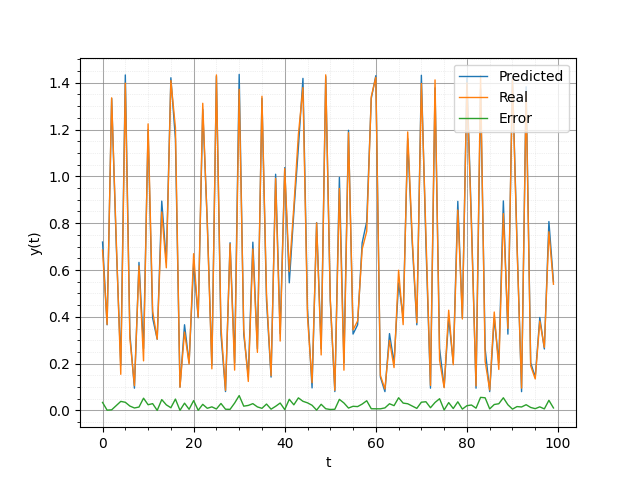
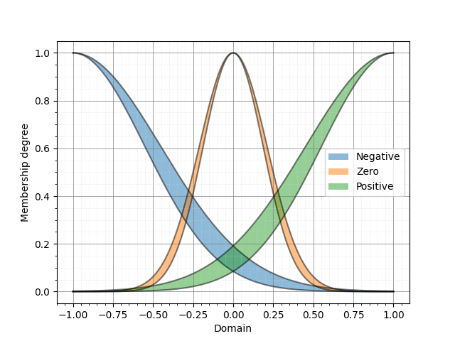
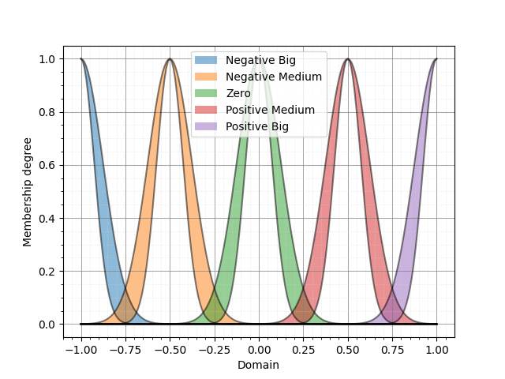
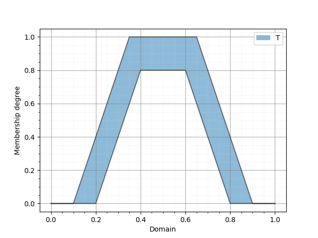
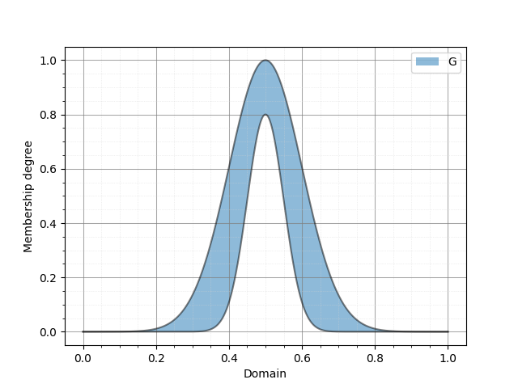

PyIT2FLS
========

<p align="center"></p>

NumPy and SciPy based toolkit for Type 1 and Interval Type 2 Fuzzy Logic Systems.

## Licence
PyIT2FLS is published under MIT license. If you are using the developed toolkit, please cite preprint of our paper [PyIT2FLS: A New Python Toolkit for Interval Type 2 Fuzzy Logic Systems](https://arxiv.org/abs/1909.10051).

BibTeX:

    @misc{haghrah2019pyit2fls,
        title={PyIT2FLS: A New Python Toolkit for Interval Type 2 Fuzzy Logic Systems},
        author={Amir Arslan Haghrah and Sehraneh Ghaemi},
        year={2019},
        eprint={1909.10051},
        archivePrefix={arXiv},
        primaryClass={eess.SY}
    }

MLA:

    Haghrah, Amir Arslan, and Sehraneh Ghaemi. "PyIT2FLS: A New Python Toolkit for Interval Type 2 Fuzzy Logic Systems." arXiv preprint arXiv:1909.10051 (2019).

## Installation
PyIT2FLS can be installed by unzipping the source code in a directory and using this command:

    (sudo) python3 setup.py install

Or you can use pip3:

    (sudo) pip3 install --upgrade pyit2fls

## Versions

### Features coming up in the next version
- [ ] Supporting Generalized Type 2 Fuzzy Sets and Systems.
- [ ] Speeding up the codes using the Python/C API.

### Some notes on version 0.6.1
- [x] Some bugs are fixed in this version.

### Some notes on version 0.6
- [x] Supporting Type 1 Fuzzy Sets and Systems.
- [x] Supporting elliptic and semi-elliptic membership functions.
- [x] Supporting generalized bell shaped membership function.
- [x] Supporting many new t-norms and s-norms.
- [x] Some bugs are fixed in this version.

### Some notes on version 0.5
- [x] Supporting both Mamdani and TSK systems.
- [x] Some bugs are fixed in this vesion. Now it is possible to use different domains for FLS inputs and outputs.

### Some notes on version 0.4
- [x] Some bugs have been fixed in this version especially in type reduction algorithms. I would like to say thanks to Dr. K.B Badri Narayanan for reporting the errors.
- [x] Some new IT2FSs are added to the toolkit.
- [x] In previous versions, the height of the IT2FS_Gaussian_UncertStd and IT2FS_Gaussian_UncertMean IT2FSs was fixed to 1, by default. But in the new version, user must give the height value in the parameters list as the last element.

## Docstrings
Further information about functions and classes in the PyIT2FLS are accessible by docstrings. After importing a function or class, they can be seen by calling the help function. For example:

```python
>>> from pyit2fls import IT2FS_Gaussian_UncertStd
>>> help(IT2FS_Gaussian_UncertStd)
```

## Examples
There are some examples provided along with the toolkit which are as below:
* [Ex1](https://github.com/Haghrah/PyIT2FLS/blob/master/examples/ex_1.py): Defining an Interval Type 2 Fuzzy Set (IT2FS).
* [Ex2](https://github.com/Haghrah/PyIT2FLS/blob/master/examples/ex_2.py): Application of join and meet operators and plotting the outputs.
* [Ex3](https://github.com/Haghrah/PyIT2FLS/blob/master/examples/ex_3.py): Defining a simple (MIMO) IT2FLS.
* [Ex4](https://github.com/Haghrah/PyIT2FLS/blob/master/examples/ex_4.py): Prediction of the Mackey-Glass chaotic time series with PSO-based parameter tuning.
* [Ex5](https://github.com/Haghrah/PyIT2FLS/blob/master/examples/ex_5.py): Designing Interval Type 2 Fuzzy PID (IT2FPID) controller for a time-delay linear system.
* [Ex6](https://github.com/Haghrah/PyIT2FLS/blob/master/examples/ex_6.py): Creating and plotting ten types of interval type two fuzzy sets. **(PyIT2FLS v0.4.0 and upper)**
* [Ex7](https://github.com/Haghrah/PyIT2FLS/blob/master/examples/ex_7.py): Similar to Ex3 but implemented using the new Mamdani class. **(PyIT2FLS v0.5.0 and upper)**
* [Ex8](https://github.com/Haghrah/PyIT2FLS/blob/master/examples/ex_8.py): Defining a simple multi-input multi-output IT2 TSK FLS. **(PyIT2FLS v0.5.0 and upper)**
* [Ex9](https://github.com/Haghrah/PyIT2FLS/blob/master/examples/ex_9.py): Defining a multi-input multi-output IT2 TSK FLS and plotting the 3D resulting output planes. **(PyIT2FLS v0.5.0 and upper)**
* [Ex10](https://github.com/Haghrah/PyIT2FLS/blob/master/examples/ex_10.py): Defining a multi-input multi-output IT2FLS with different domains for each of input and output variables, and plotting the output surfaces of the system. **(PyIT2FLS v0.5.0 and upper)**
* [Ex11](https://github.com/Haghrah/PyIT2FLS/blob/master/examples/ex_11.py): Generating random rule-bases. **(PyIT2FLS v0.5.0 and upper)**
* [Ex12](https://github.com/Haghrah/PyIT2FLS/blob/master/examples/ex_12.py): Using six different t-norms with meet operator. **(PyIT2FLS v0.6.0 and upper)**
* [Ex13](https://github.com/Haghrah/PyIT2FLS/blob/master/examples/ex_13.py): Using six different s-norms with join operator. **(PyIT2FLS v0.6.0 and upper)**
* [Ex14](https://github.com/Haghrah/PyIT2FLS/blob/master/examples/ex_14.py): MIMO Type 1 Mamdani Fuzzy Logic System. **(PyIT2FLS v0.6.0 and upper)**
* [Ex15](https://github.com/Haghrah/PyIT2FLS/blob/master/examples/ex_15.py): MIMO Type 1 TSK Fuzzy Logic System. **(PyIT2FLS v0.6.0 and upper)**

### Some output plots

* Ex4:

 

* Ex5:

   

* Ex6:

   

   

* Ex9: 


 

* Ex10: 

 

 
