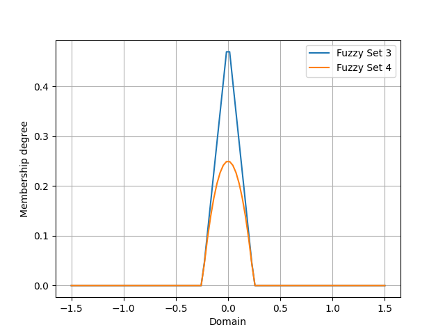

PyIT2FLS
========

.. automodule:: pyit2fls

PyIT2FLS is a NumPy and SciPy-based toolkit for Type 1 
and Interval Type 2 Fuzzy Logic Systems.
   
PyIT2FLS is published under MIT license. If you are using 
the developed toolkit, please cite preprint of our paper 
PyIT2FLS: A New Python Toolkit for Interval Type 2 Fuzzy 
Logic Systems.

BibTeX:

.. code-block:: Bibtex

    @misc{haghrah2019pyit2fls,
        title={PyIT2FLS: A New Python Toolkit for Interval Type 2 Fuzzy Logic Systems},
        author={Amir Arslan Haghrah and Sehraneh Ghaemi},
        year={2019},
        eprint={1909.10051},
        archivePrefix={arXiv},
        primaryClass={eess.SY}
    }

MLA:

.. code-block:: markdown

    Haghrah, Amir Arslan, and Sehraneh Ghaemi. "PyIT2FLS: A New Python Toolkit for Interval Type 2 Fuzzy Logic Systems." arXiv preprint arXiv:1909.10051 (2019).

Installation
------------

PyIT2FLS can be installed by unzipping the source 
code in a directory and using this command inside 
the PyIT2FLS folder:

.. code-block:: shell

    pip3 install .

Or you can use pip3:

.. code-block:: shell

    pip3 install --upgrade pyit2fls

Getting started
---------------

This section provides some elementary examples for using PyIT2FLS library. 
Advanced examples are accessible from examples directory of PyIT2FLS github 
repository. 

Example 1
^^^^^^^^^

In the first example, we are going to define two trapezoidal type 1 fuzzy sets 
and then apply fuzzy AND and OR operators on them. First we define the trapezoidal fuzzy 
sets using the T1FS class and trapezoid_mf functions, plot them all together using 
T1FS_plot function:

.. code-block:: python

    from pyit2fls import (T1FS, trapezoid_mf, T1FS_plot, )
    from numpy import linspace

    domain = linspace(-1.5, 1.5, 100)
    set1 = T1FS(domain, trapezoid_mf, [-1.25, -0.75, -0.25, 0.25, 1.])
    set2 = T1FS(domain, trapezoid_mf, [-0.25, 0.25, 0.75, 1.25, 1.])
    T1FS_plot(set1, set2, legends=["Trapezoidal Set 1", "Trapezoidal Set 2", ])

The output of this code would be as below:

.. image:: ../_static/Figure_1.png
   :alt: Defining two trapezoidal fuzzy sets.
   :width: 400px
   :align: center

Then, we try to compute the AND of these two sets using two different T-norms:

.. code-block:: python

    from pyit2fls import (min_t_norm, product_t_norm, T1FS_AND, )

    set3 = T1FS_AND(domain, set1, set2, min_t_norm)
    set4 = T1FS_AND(domain, set1, set2, product_t_norm)
    T1FS_plot(set3, set4, legends=["Fuzzy Set 3", "Fuzzy Set 4", ])

The output of this code would be as below:

Finally, we try to compute the OR of these two sets using two different S-norms:

.. code-block:: python

    from pyit2fls import (max_s_norm, probabilistic_sum_s_norm, T1FS_OR, )

    set5 = T1FS_OR(domain, set1, set2, max_s_norm)
    set6 = T1FS_OR(domain, set1, set2, probabilistic_sum_s_norm)
    T1FS_plot(set5, set6, legends=["Fuzzy Set 5", "Fuzzy Set 6", ])

The output of this code would be as below:

.. image:: ../_static/Figure_3.png
   :alt: Calculating OR of set1 and set2.
   :width: 400px
   :align: center

Example 2
^^^^^^^^^

