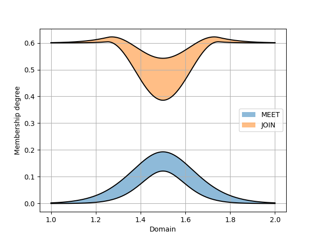

PyIT2FLS
========

.. automodule:: pyit2fls

PyIT2FLS is a NumPy and SciPy-based toolkit for Type 1 
and Interval Type 2 Fuzzy Logic Systems.
   
PyIT2FLS is published under MIT license. If you are using 
the developed toolkit, please cite preprint of our paper 
PyIT2FLS: A New Python Toolkit for Interval Type 2 Fuzzy 
Logic Systems.

BibTeX:

.. code-block:: Bibtex

    @misc{haghrah2019pyit2fls,
        title={PyIT2FLS: A New Python Toolkit for Interval Type 2 Fuzzy Logic Systems},
        author={Amir Arslan Haghrah and Sehraneh Ghaemi},
        year={2019},
        eprint={1909.10051},
        archivePrefix={arXiv},
        primaryClass={eess.SY}
    }

MLA:

.. code-block:: markdown

    Haghrah, Amir Arslan, and Sehraneh Ghaemi. "PyIT2FLS: A New Python Toolkit for Interval Type 2 Fuzzy Logic Systems." arXiv preprint arXiv:1909.10051 (2019).

Installation
------------

PyIT2FLS can be installed by unzipping the source 
code in a directory and using this command inside 
the PyIT2FLS folder:

.. code-block:: shell

    pip3 install .

Or you can use pip3:

.. code-block:: shell

    pip3 install --upgrade pyit2fls

Support My Work with Tether (USDT)
----------------------------------
If you find this Python library useful and would like to support its development, donations are greatly appreciated. You can send Tether (USDT) directly to the following address:

    TN1stagYLtqq4MUKPj6Q3fqtH3GittRawE

Thank you for your contribution, which helps maintain and improve this project!

Getting started
---------------

This section provides some elementary examples for using PyIT2FLS library. 
Advanced examples are accessible from examples directory of PyIT2FLS github 
repository. 

Example 1: Defining type 1 fuzzy sets and performing AND and OR operators on them
^^^^^^^^^^^^^^^^^^^^^^^^^^^^^^^^^^^^^^^^^^^^^^^^^^^^^^^^^^^^^^^^^^^^^^^^^^^^^^^^^

In the first example, we are going to define two trapezoidal type 1 fuzzy sets 
and then apply fuzzy AND and OR operators on them. First we define the trapezoidal fuzzy 
sets using the T1FS class and trapezoid_mf functions, plot them all together using 
T1FS_plot function:

.. code-block:: python

    from pyit2fls import (T1FS, trapezoid_mf, T1FS_plot, )
    from numpy import linspace

    domain = linspace(-1.5, 1.5, 100)
    set1 = T1FS(domain, trapezoid_mf, [-1.25, -0.75, -0.25, 0.25, 1.])
    set2 = T1FS(domain, trapezoid_mf, [-0.25, 0.25, 0.75, 1.25, 1.])
    T1FS_plot(set1, set2, legends=["Trapezoidal Set 1", "Trapezoidal Set 2", ])

The output of this code would be as below:

.. image:: ../_static/Figure_1.png
   :alt: Defining two trapezoidal fuzzy sets.
   :width: 400px
   :align: center

Then, we try to compute the AND of these two sets using two different T-norms:

.. code-block:: python

    from pyit2fls import (min_t_norm, product_t_norm, T1FS_AND, )

    set3 = T1FS_AND(domain, set1, set2, min_t_norm)
    set4 = T1FS_AND(domain, set1, set2, product_t_norm)
    T1FS_plot(set3, set4, legends=["Fuzzy Set 3", "Fuzzy Set 4", ])

The output of this code would be as below:

Finally, we try to compute the OR of these two sets using two different S-norms:

.. code-block:: python

    from pyit2fls import (max_s_norm, probabilistic_sum_s_norm, T1FS_OR, )

    set5 = T1FS_OR(domain, set1, set2, max_s_norm)
    set6 = T1FS_OR(domain, set1, set2, probabilistic_sum_s_norm)
    T1FS_plot(set5, set6, legends=["Fuzzy Set 5", "Fuzzy Set 6", ])

The output of this code would be as below:

.. image:: ../_static/Figure_3.png
   :alt: Calculating OR of set1 and set2.
   :width: 400px
   :align: center

Example 2: Defining type 1 TSK fuzzy systems
^^^^^^^^^^^^^^^^^^^^^^^^^^^^^^^^^^^^^^^^^^^^

In the second example, we are going to define a simple type 1 TSK fuzzy system, 
calculate its output for some inputs, and plot the control surface for it. So, 
we first define the T1FSs representing inputs of the fuzzy system.

.. code-block:: python

    from pyit2fls import (T1TSK, T1FS, gaussian_mf, T1FS_plot, )
    from numpy import (linspace, meshgrid, zeros, )
    from mpl_toolkits import mplot3d
    import matplotlib.pyplot as plt
    from matplotlib import cm
    from matplotlib.ticker import (LinearLocator, FormatStrFormatter, )

    domain = linspace(-1.5, 1.5, 100)
    t1fs1 = T1FS(domain, gaussian_mf, [-0.5, 0.5, 1.])
    t1fs2 = T1FS(domain, gaussian_mf, [ 0.5, 0.5, 1.])
    T1FS_plot(t1fs1, t1fs2, legends=["Gaussian Set 1", "Gaussian Set 2", ])

The output of this code would be as below:

.. image:: ../_static/Figure_4.png
   :alt: Defining two fuzzy sets representing the inputs of the fuzzy system.
   :width: 400px
   :align: center

As you see, there are two Gaussian fuzzy sets. The parameters of a Gaussian 
membership function are mean, standard deviation, and height, respectively. Then 
we should define the T1TSK system and its input and output variables.

.. code-block:: python

    myT1TSK = T1TSK()
    myT1TSK.add_input_variable("X1")
    myT1TSK.add_input_variable("X2")

    myT1TSK.add_output_variable("Y")

The next thing we should define is the outputs of the fuzzy rules. These outputs 
must be functions of the inputs. According to our definition of myT1TSK, we have 
two inputs. So, each output function must have to inputs. Let's assume that there 
will be four rules.

.. code-block:: python

    def Y1(X1, X2):
        return 2. * X1 + 3. * X2

    def Y2(X1, X2):
        return -1.5 * X1 + 2. * X2

    def Y3(X1, X2):
        return -2. * X1 - 1.2 * X2

    def Y4(X1, X2):
        return 5. * X1 - 2.5 * X2

After defining the output functions, we will define the rules using the following rule-base:

+-----------------+----------------+-----------------+
|                 | **X2**: t1fs1  | **X2**: t1fs2   |
+-----------------+----------------+-----------------+
| **X1**: t1fs1   | **Y**: Y1      | **Y**: Y2       |
+-----------------+----------------+-----------------+
| **X1**: t1fs2   | **Y**: Y3      | **Y**: Y4       |
+-----------------+----------------+-----------------+

.. code-block:: python

    myT1TSK.add_rule([("X1", t1fs1), ("X2", t1fs1)], 
                [("Y", Y1), ])
    myT1TSK.add_rule([("X1", t1fs1), ("X2", t1fs2)], 
                [("Y", Y2), ])
    myT1TSK.add_rule([("X1", t1fs2), ("X2", t1fs1)], 
                [("Y", Y3), ])
    myT1TSK.add_rule([("X1", t1fs2), ("X2", t1fs2)], 
                [("Y", Y4), ])

Now, it is time to evaluate the system output for different points in the univertse 
of discourse and plot the control surface:

.. code-block:: python

    X1, X2 = meshgrid(domain, domain)
    O = zeros(shape=X1.shape)

    for i, x1 in zip(range(len(domain)), domain):
        for j, x2 in zip(range(len(domain)), domain):
            o = myT1TSK.evaluate({"X1":x1, "X2":x2}, params=(x1, x2))
            O[i, j] = o["Y"]

    fig = plt.figure()
    ax = fig.add_subplot(111, projection="3d")
    surf = ax.plot_surface(X1, X2, O, cmap=cm.coolwarm,
                        linewidth=0, antialiased=False)
    ax.zaxis.set_major_locator(LinearLocator(10))
    ax.zaxis.set_major_formatter(FormatStrFormatter('%.02f'))
    fig.colorbar(surf, shrink=0.5, aspect=5)
    plt.show()

Finally, the output of this code would be as below:

Example 3: Defining type 1 Mamdani fuzzy systems
^^^^^^^^^^^^^^^^^^^^^^^^^^^^^^^^^^^^^^^^^^^^^^^^

Let's define a simple type 1 Mamdani fuzzy system using PyIT2FLS, calculate 
its output for some inputs, and plot the control surface for it. So, we first 
define the T1FSs representing inputs of the fuzzy system.

.. code-block:: python

    from pyit2fls import (T1Mamdani, T1FS, gaussian_mf, T1FS_plot, )
    from numpy import (linspace, meshgrid, zeros, )
    from mpl_toolkits import mplot3d
    import matplotlib.pyplot as plt
    from matplotlib import cm
    from matplotlib.ticker import (LinearLocator, FormatStrFormatter, )

    inputDomain = linspace(-1.5, 1.5, 100)
    t1fs1 = T1FS(inputDomain, gaussian_mf, [-0.5, 0.5, 1.])
    t1fs2 = T1FS(inputDomain, gaussian_mf, [ 0.5, 0.5, 1.])
    T1FS_plot(t1fs1, t1fs2, legends=["Gaussian Set 1", "Gaussian Set 2", ])

The output of this code would be as below:

.. image:: ../_static/Figure_6.png
   :alt: Defining two fuzzy sets representing the inputs of the fuzzy system.
   :width: 400px
   :align: center

As you see, there are two Gaussian fuzzy sets for describing the input variables. 
After that, we should define the T1FSs representing outputs of the fuzzy system.

.. code-block:: python

    outputDomain = linspace(-10., 10., 1000)
    t1fs3 = T1FS(outputDomain, gaussian_mf, [-7.5, 2.0, 1.])
    t1fs4 = T1FS(outputDomain, gaussian_mf, [-2.5, 2.0, 1.])
    t1fs5 = T1FS(outputDomain, gaussian_mf, [ 2.5, 2.0, 1.])
    t1fs6 = T1FS(outputDomain, gaussian_mf, [ 7.5, 2.0, 1.])
    T1FS_plot(t1fs3, t1fs4, t1fs5, t1fs6, 
              legends=["Gaussian Set 3", "Gaussian Set 4", 
                       "Gaussian Set 5", "Gaussian Set 6", ])

We have defined four sets in this step. So, for all possible fuzzy rules we can 
define a distinct output. The output T1FSs would be as following:

.. image:: ../_static/Figure_7.png
   :alt: Defining four fuzzy sets representing the outputs of the fuzzy system.
   :width: 400px
   :align: center

Now, it is time to define the type 1 Mamdani system and its input and output variables. 
We can choose inference engine and defuzzification method among some famous methods (refer 
to the documentations for more details). In our example, we will use "Product" inference 
engine and center of gravity, "CoG", defuzzification method. Also, we name the inputs as 
"X1" and "X2", and the output as "Y".

.. code-block:: python

    myT1Mamdani = T1Mamdani(engine="Product", defuzzification="CoG")
    myT1Mamdani.add_input_variable("X1")
    myT1Mamdani.add_input_variable("X2")

    myT1Mamdani.add_output_variable("Y")

After defining the T1Mamdani system, it is time to define the rule-base of the fuzzy 
system. We use the rules represented in the following table to define the rule-base.

+-----------------+-------------------+--------------------+
|                 | **X2**: t1fs1     | **X2**: t1fs2      |
+-----------------+-------------------+--------------------+
| **X1**: t1fs1   | **Y**: t1fs3      | **Y**: t1fs4       |
+-----------------+-------------------+--------------------+
| **X1**: t1fs2   | **Y**: t1fs5      | **Y**: t1fs6       |
+-----------------+-------------------+--------------------+

The codes to add rules to the rule-base would be as following:

.. code-block:: python

    myT1Mamdani.add_rule([("X1", t1fs1), ("X2", t1fs1)], [("Y", t1fs3), ])
    myT1Mamdani.add_rule([("X1", t1fs1), ("X2", t1fs2)], [("Y", t1fs4), ])
    myT1Mamdani.add_rule([("X1", t1fs2), ("X2", t1fs1)], [("Y", t1fs5), ])
    myT1Mamdani.add_rule([("X1", t1fs2), ("X2", t1fs2)], [("Y", t1fs6), ])

Finally, it is time to evaluate the system output for different points in the univertse 
of discourse and plot the control surface:

.. code-block:: python

    X1, X2 = meshgrid(inputDomain, inputDomain)
    O = zeros(shape=X1.shape)

    for i, x1 in zip(range(len(inputDomain)), inputDomain):
        for j, x2 in zip(range(len(inputDomain)), inputDomain):
            s, c = myT1Mamdani.evaluate({"X1":x1, "X2":x2})
            O[i, j] = c["Y"]

    fig = plt.figure()
    ax = fig.add_subplot(111, projection="3d")
    surf = ax.plot_surface(X1, X2, O, cmap=cm.coolwarm,
                        linewidth=0, antialiased=False)
    ax.zaxis.set_major_locator(LinearLocator(10))
    ax.zaxis.set_major_formatter(FormatStrFormatter('%.02f'))
    fig.colorbar(surf, shrink=0.5, aspect=5)
    plt.show()

And, the output of this code would be as below:

.. image:: ../_static/Figure_8.png
   :alt: The control surface of the final type 1 fuzzy Mamdani system.
   :width: 400px
   :align: center

Example 4: Defining interval type 2 fuzzy sets
^^^^^^^^^^^^^^^^^^^^^^^^^^^^^^^^^^^^^^^^^^^^^^

The output of this code would be as below:

.. image:: ../_static/Figure_9.png
   :alt: Defining some interval type 2 fuzzy sets.
   :width: 800px
   :align: center

Example 5. Performing MEET and JOIN operators on IT2FSs
^^^^^^^^^^^^^^^^^^^^^^^^^^^^^^^^^^^^^^^^^^^^^^^^^^^^^^^

Example 6: Defining interval type 2 TSK fuzzy systems
^^^^^^^^^^^^^^^^^^^^^^^^^^^^^^^^^^^^^^^^^^^^^^^^^^^^^

Example 7: Defining interval type 2 Mamdani fuzzy systems
^^^^^^^^^^^^^^^^^^^^^^^^^^^^^^^^^^^^^^^^^^^^^^^^^^^^^^^^^

