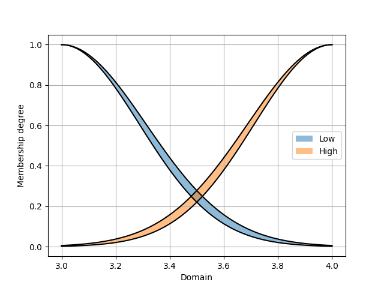

PyIT2FLS
========

.. automodule:: pyit2fls

**PyIT2FLS** is a NumPy- and SciPy-based toolkit designed for working with Type 1 and 
Interval Type 2 Fuzzy Logic Systems.
   
The toolkit is distributed under the MIT License. If you use PyIT2FLS in your work, 
please cite the preprint of our paper, PyIT2FLS: A New Python Toolkit for Interval 
Type 2 Fuzzy Logic Systems.

BibTeX:

.. code-block:: Bibtex

    @misc{haghrah2019pyit2fls,
        title={PyIT2FLS: A New Python Toolkit for Interval Type 2 Fuzzy Logic Systems},
        author={Amir Arslan Haghrah and Sehraneh Ghaemi},
        year={2019},
        eprint={1909.10051},
        archivePrefix={arXiv},
        primaryClass={eess.SY}
    }

MLA:

.. code-block:: markdown

    Haghrah, Amir Arslan, and Sehraneh Ghaemi. "PyIT2FLS: A New Python Toolkit for Interval Type 2 Fuzzy Logic Systems." arXiv preprint arXiv:1909.10051 (2019).

Installation
------------

PyIT2FLS can be installed using one of the following methods:

From Source
^^^^^^^^^^^

Download and unzip the source code into a directory. Then, 
navigate to the PyIT2FLS folder and run the following command:

.. code-block:: shell

    pip3 install .

Using pip
^^^^^^^^^

Alternatively, you can install or upgrade PyIT2FLS directly from PyPI using:

.. code-block:: shell

    pip3 install --upgrade pyit2fls

Support My Work with Tether (USDT)
----------------------------------
If you find this Python library helpful and wish to support its ongoing development, 
your donations are greatly appreciated. You can contribute Tether (USDT) to the following 
wallet address:

    TN1stagYLtqq4MUKPj6Q3fqtH3GittRawE

Thank you for your generosity—it directly helps maintain and enhance this project!

Getting started
---------------

This section introduces basic examples of how to use the PyIT2FLS library. For more 
advanced use cases, please refer to the examples directory in the PyIT2FLS github 
repository. 

Example 1: Defining type 1 fuzzy sets and performing AND/OR operators on them
^^^^^^^^^^^^^^^^^^^^^^^^^^^^^^^^^^^^^^^^^^^^^^^^^^^^^^^^^^^^^^^^^^^^^^^^^^^^^^^^^

In this example, we define two trapezoidal Type 1 fuzzy sets and apply fuzzy AND and OR 
operators on them. First, we create the trapezoidal fuzzy sets using the *T1FS class* and 
the *trapezoid_mf* function. Then, we plot the fuzzy sets together using the *T1FS_plot* 
function:

.. code-block:: python

    from pyit2fls import (T1FS, trapezoid_mf, T1FS_plot, )
    from numpy import linspace

    domain = linspace(-1.5, 1.5, 100)
    set1 = T1FS(domain, trapezoid_mf, [-1.25, -0.75, -0.25, 0.25, 1.])
    set2 = T1FS(domain, trapezoid_mf, [-0.25, 0.25, 0.75, 1.25, 1.])
    T1FS_plot(set1, set2, legends=["Trapezoidal Set 1", "Trapezoidal Set 2", ])

The output of this code is shown below:

.. image:: ../_static/Figure_1.png
   :alt: Defining two trapezoidal fuzzy sets.
   :width: 400px
   :align: center

Next, we compute the AND of these two sets using two different T-norms:

.. code-block:: python

    from pyit2fls import (min_t_norm, product_t_norm, T1FS_AND, )

    set3 = T1FS_AND(domain, set1, set2, min_t_norm)
    set4 = T1FS_AND(domain, set1, set2, product_t_norm)
    T1FS_plot(set3, set4, legends=["Fuzzy Set 3", "Fuzzy Set 4", ])

The output of this code is shown below:

.. image:: ../_static/Figure_2.png
   :alt: Calculating AND of set1 and set2.
   :width: 400px
   :align: center

Finally, we compute the OR of these two sets using two different S-norms:

.. code-block:: python

    from pyit2fls import (max_s_norm, probabilistic_sum_s_norm, T1FS_OR, )

    set5 = T1FS_OR(domain, set1, set2, max_s_norm)
    set6 = T1FS_OR(domain, set1, set2, probabilistic_sum_s_norm)
    T1FS_plot(set5, set6, legends=["Fuzzy Set 5", "Fuzzy Set 6", ])

The output of this code is shown below:

.. image:: ../_static/Figure_3.png
   :alt: Calculating OR of set1 and set2.
   :width: 400px
   :align: center

Example 2: Defining type 1 TSK fuzzy systems
^^^^^^^^^^^^^^^^^^^^^^^^^^^^^^^^^^^^^^^^^^^^

In this example, we define a simple Type 1 TSK fuzzy system, calculate its output 
for specific inputs, and plot its control surface. First, we define the *T1FS* objects 
representing the inputs of the fuzzy system.

.. code-block:: python

    from pyit2fls import (T1TSK, T1FS, gaussian_mf, T1FS_plot, )
    from numpy import (linspace, meshgrid, zeros, )
    from mpl_toolkits import mplot3d
    import matplotlib.pyplot as plt
    from matplotlib import cm
    from matplotlib.ticker import (LinearLocator, FormatStrFormatter, )

    domain = linspace(-1.5, 1.5, 100)
    t1fs1 = T1FS(domain, gaussian_mf, [-0.5, 0.5, 1.])
    t1fs2 = T1FS(domain, gaussian_mf, [ 0.5, 0.5, 1.])
    T1FS_plot(t1fs1, t1fs2, legends=["Gaussian Set 1", "Gaussian Set 2", ])

The output of this code is shown below:

.. image:: ../_static/Figure_4.png
   :alt: Defining two fuzzy sets representing the inputs of the fuzzy system.
   :width: 400px
   :align: center

As shown, there are two Gaussian fuzzy sets. The parameters of a Gaussian membership 
function are the mean, standard deviation, and height, respectively. Next, we define 
the *T1TSK* system along with its input and output variables.

.. code-block:: python

    myT1TSK = T1TSK()
    myT1TSK.add_input_variable("X1")
    myT1TSK.add_input_variable("X2")

    myT1TSK.add_output_variable("Y")

Next, we define the outputs of the fuzzy rules. These outputs must be functions of 
the inputs. Since our myT1TSK system has two inputs, each output function must also 
depend on two inputs. Let's assume the system includes four rules.

.. code-block:: python

    def Y1(X1, X2):
        return 2. * X1 + 3. * X2

    def Y2(X1, X2):
        return -1.5 * X1 + 2. * X2

    def Y3(X1, X2):
        return -2. * X1 - 1.2 * X2

    def Y4(X1, X2):
        return 5. * X1 - 2.5 * X2

After defining the output functions, we define the rules using the following rule base:

+-----------------+----------------+-----------------+
|                 | **X2**: t1fs1  | **X2**: t1fs2   |
+-----------------+----------------+-----------------+
| **X1**: t1fs1   | **Y**: Y1      | **Y**: Y2       |
+-----------------+----------------+-----------------+
| **X1**: t1fs2   | **Y**: Y3      | **Y**: Y4       |
+-----------------+----------------+-----------------+

.. code-block:: python

    myT1TSK.add_rule([("X1", t1fs1), ("X2", t1fs1)], 
                [("Y", Y1), ])
    myT1TSK.add_rule([("X1", t1fs1), ("X2", t1fs2)], 
                [("Y", Y2), ])
    myT1TSK.add_rule([("X1", t1fs2), ("X2", t1fs1)], 
                [("Y", Y3), ])
    myT1TSK.add_rule([("X1", t1fs2), ("X2", t1fs2)], 
                [("Y", Y4), ])

Now, it is time to evaluate the system's output for various points in the universe of 
discourse and plot the control surface:

.. code-block:: python

    X1, X2 = meshgrid(domain, domain)
    O = zeros(shape=X1.shape)

    for i, x1 in zip(range(len(domain)), domain):
        for j, x2 in zip(range(len(domain)), domain):
            o = myT1TSK.evaluate({"X1":x1, "X2":x2}, params=(x1, x2))
            O[i, j] = o["Y"]

    fig = plt.figure()
    ax = fig.add_subplot(111, projection="3d")
    surf = ax.plot_surface(X1, X2, O, cmap=cm.coolwarm,
                        linewidth=0, antialiased=False)
    ax.zaxis.set_major_locator(LinearLocator(10))
    ax.zaxis.set_major_formatter(FormatStrFormatter('%.02f'))
    fig.colorbar(surf, shrink=0.5, aspect=5)
    plt.show()

Finally, the output of this code is shown below:

.. image:: ../_static/Figure_5.png
   :alt: The control surface of the final type 1 fuzzy TSK system.
   :width: 400px
   :align: center

Example 3: Defining type 1 Mamdani fuzzy systems
^^^^^^^^^^^^^^^^^^^^^^^^^^^^^^^^^^^^^^^^^^^^^^^^

Let's define a simple type 1 Mamdani fuzzy system using PyIT2FLS, calculate 
its output for some inputs, and plot the control surface for it. So, we first 
define the T1FSs representing inputs of the fuzzy system.

.. code-block:: python

    from pyit2fls import (T1Mamdani, T1FS, gaussian_mf, T1FS_plot, )
    from numpy import (linspace, meshgrid, zeros, )
    from mpl_toolkits import mplot3d
    import matplotlib.pyplot as plt
    from matplotlib import cm
    from matplotlib.ticker import (LinearLocator, FormatStrFormatter, )

    inputDomain = linspace(-1.5, 1.5, 100)
    t1fs1 = T1FS(inputDomain, gaussian_mf, [-0.5, 0.5, 1.])
    t1fs2 = T1FS(inputDomain, gaussian_mf, [ 0.5, 0.5, 1.])
    T1FS_plot(t1fs1, t1fs2, legends=["Gaussian Set 1", "Gaussian Set 2", ])

The output of this code would be as below:

.. image:: ../_static/Figure_6.png
   :alt: Defining two fuzzy sets representing the inputs of the fuzzy system.
   :width: 400px
   :align: center

As you see, there are two Gaussian fuzzy sets for describing the input variables. 
After that, we should define the T1FSs representing outputs of the fuzzy system.

.. code-block:: python

    outputDomain = linspace(-10., 10., 1000)
    t1fs3 = T1FS(outputDomain, gaussian_mf, [-7.5, 2.0, 1.])
    t1fs4 = T1FS(outputDomain, gaussian_mf, [-2.5, 2.0, 1.])
    t1fs5 = T1FS(outputDomain, gaussian_mf, [ 2.5, 2.0, 1.])
    t1fs6 = T1FS(outputDomain, gaussian_mf, [ 7.5, 2.0, 1.])
    T1FS_plot(t1fs3, t1fs4, t1fs5, t1fs6, 
              legends=["Gaussian Set 3", "Gaussian Set 4", 
                       "Gaussian Set 5", "Gaussian Set 6", ])

We have defined four sets in this step. So, for all possible fuzzy rules we can 
define a distinct output. The output T1FSs would be as following:

.. image:: ../_static/Figure_7.png
   :alt: Defining four fuzzy sets representing the outputs of the fuzzy system.
   :width: 400px
   :align: center

Now, it is time to define the type 1 Mamdani system and its input and output variables. 
We can choose inference engine and defuzzification method among some famous methods (refer 
to the documentations for more details). In our example, we will use "Product" inference 
engine and center of gravity, "CoG", defuzzification method. Also, we name the inputs as 
"X1" and "X2", and the output as "Y".

.. code-block:: python

    myT1Mamdani = T1Mamdani(engine="Product", defuzzification="CoG")
    myT1Mamdani.add_input_variable("X1")
    myT1Mamdani.add_input_variable("X2")

    myT1Mamdani.add_output_variable("Y")

After defining the T1Mamdani system, it is time to define the rule-base of the fuzzy 
system. We use the rules represented in the following table to define the rule-base.

+-----------------+-------------------+--------------------+
|                 | **X2**: t1fs1     | **X2**: t1fs2      |
+-----------------+-------------------+--------------------+
| **X1**: t1fs1   | **Y**: t1fs3      | **Y**: t1fs4       |
+-----------------+-------------------+--------------------+
| **X1**: t1fs2   | **Y**: t1fs5      | **Y**: t1fs6       |
+-----------------+-------------------+--------------------+

The codes to add rules to the rule-base would be as following:

.. code-block:: python

    myT1Mamdani.add_rule([("X1", t1fs1), ("X2", t1fs1)], [("Y", t1fs3), ])
    myT1Mamdani.add_rule([("X1", t1fs1), ("X2", t1fs2)], [("Y", t1fs4), ])
    myT1Mamdani.add_rule([("X1", t1fs2), ("X2", t1fs1)], [("Y", t1fs5), ])
    myT1Mamdani.add_rule([("X1", t1fs2), ("X2", t1fs2)], [("Y", t1fs6), ])

Finally, it is time to evaluate the system output for different points in the univertse 
of discourse and plot the control surface:

.. code-block:: python

    X1, X2 = meshgrid(inputDomain, inputDomain)
    O = zeros(shape=X1.shape)

    for i, x1 in zip(range(len(inputDomain)), inputDomain):
        for j, x2 in zip(range(len(inputDomain)), inputDomain):
            s, c = myT1Mamdani.evaluate({"X1":x1, "X2":x2})
            O[i, j] = c["Y"]

    fig = plt.figure()
    ax = fig.add_subplot(111, projection="3d")
    surf = ax.plot_surface(X1, X2, O, cmap=cm.coolwarm,
                        linewidth=0, antialiased=False)
    ax.zaxis.set_major_locator(LinearLocator(10))
    ax.zaxis.set_major_formatter(FormatStrFormatter('%.02f'))
    fig.colorbar(surf, shrink=0.5, aspect=5)
    plt.show()

And, the output of this code would be as below:

.. image:: ../_static/Figure_8.png
   :alt: The control surface of the final type 1 fuzzy Mamdani system.
   :width: 400px
   :align: center

Example 4: Defining interval type 2 fuzzy sets
^^^^^^^^^^^^^^^^^^^^^^^^^^^^^^^^^^^^^^^^^^^^^^

In this example, we are going to define and plot ten different and well-known types 
of interval type 2 fuzzy sets. We need some initial imports and defining the universe 
of discourse, before using the IT2FS class. This class requires five parameters for 
creating an interval type 2 fuzzy set, domain, upper membership function, parameters 
of the upper membership function, lower membership function, and parameters of the 
lower membership function.

.. code-block:: python

    from pyit2fls import (IT2FS, tri_mf, const_mf, rtri_mf, ltri_mf, 
                        trapezoid_mf, gaussian_mf, IT2FS_Gaussian_UncertMean, 
                        IT2FS_Gaussian_UncertStd, R_IT2FS_Gaussian_UncertStd, 
                        L_IT2FS_Gaussian_UncertStd, IT2FS_plot, )
    from numpy import linspace

    domain = linspace(0, 4, 1001)

Now the first IT2FS we are going to define is the constant interval type 2 fuzzy 
set. It needs only the UMF and the LMF as constant membership functions. The 
constant membership function has only one parameter, its value. The check_set 
option while defining an IT2FS can be used for debuginh purposes. Sometimes there can 
be mistake in fuzzy set parameters causing LMF to have greater membership degree than 
the UMF in some points on the universe of discourse. In such a situation, if check_set 
is set zero, an exceptation will be raised.

.. code-block:: python

    Const = IT2FS(domain, const_mf, [1.0], const_mf, [0.9], check_set=True)

The next IT2FS is triangular interval type 2 fuzzy set. It has triangular-type membership 
function for both UMF and LMF. The parameters for a triangular membership function defined 
by tri_mf are left, center, right, and height of the triangle.

.. code-block:: python

    Tri = IT2FS(domain, tri_mf, [0.7, 1.0, 1.3, 0.3], tri_mf, [0.8, 1.0, 1.2, 0.2], check_set=True)

We can also define left and right triangular interval type 2 fuzzy sets using rtri_mf and 
ltri_mf functions. The required parameters for rtri_mf are right, center, and height. 
Similarly, for ltri_mf, the parameters are left, center, and height.

.. code-block:: python

    RTri = IT2FS(domain, rtri_mf, [1.85, 1.25, 0.8], rtri_mf, [1.75, 1.15, 0.8], check_set=True)
    LTri = IT2FS(domain, ltri_mf, [0.15, 0.75, 0.7], ltri_mf, [0.25, 0.85, 0.7], check_set=True)

The next well-known interval type 2 fuzzy set is the trapezoidal. We can define it using 
trapezoidal membership function, trapezoid_mf. It has five parameters, left, left-center, 
right-center, right, and height, respectively.

.. code-block:: python

    Trapezoid = IT2FS(domain, 
                    trapezoid_mf, [0.45, 0.85, 1.15, 1.55, 0.5], 
                    trapezoid_mf, [0.55, 0.95, 1.05, 1.45, 0.45], 
                    check_set=True)

We can also define Gaussian-type sets, i.e., general Gaussian sets, Gaussian sets with 
uncertain mean value, and Gaussian sets with uncertain standard deviation value. As a 
general form Gaussian sets can be defined using IT2FS class and gaussian_mf function. 
The parameters for gaussian_mf should be mean value, standard deviation, and height. 

Defining Gaussian sets with uncertain mean value and Gaussian sets with uncertain 
standard deviation value have been made easy by providing two functions 
IT2FS_Gaussian_UncertMean and IT2FS_Gaussian_UncertStd. The inputs of the 
IT2FS_Gaussian_UncertMean are domain and parameters as a list. The parameters list 
consists of mean center, mean spread, standard deviation, and height. For the function 
IT2FS_Gaussian_UncertStd, the inputs are also similar, but the parameters list consists of 
mean, standard deviation center, standard deviation spread, and height.

.. code-block:: python

    Gaussian = IT2FS(domain, 
                     gaussian_mf, [2.25, 0.1, 0.5], 
                     gaussian_mf, [2.25, 0.05, 0.4], 
                     check_set=True)
    Gaussian_UncertMean = IT2FS_Gaussian_UncertMean(domain, [2.5, 0.1, 0.1, 0.5])
    Gaussian_UncertStd = IT2FS_Gaussian_UncertStd(domain, [2.75, 0.1, 0.05, 0.5])

There are two other Gaussian-type fuzzy sets that are widely used in applications, which 
also PyIT2FLS provides a specific function for defining them easily, right and left-sided 
Gaussian IT2FSs with uncertain standard deviation value. The inputs of these functions, 
R_IT2FS_Gaussian_UncertStd and L_IT2FS_Gaussian_UncertStd, are domain and parameters list. 
The parameters list for both of them should be mean, standard deviation center, standard 
deviation spread, and height.

.. code-block:: python

    RGaussian_UncertStd = R_IT2FS_Gaussian_UncertStd(domain, [3.25, 0.2, 0.05, 0.6])
    LGaussian_UncertStd = L_IT2FS_Gaussian_UncertStd(domain, [3.75, 0.2, 0.05, 0.6])

Finally, let's plot all these sets using the IT2FS_plot function:

.. code-block:: python

    IT2FS_plot(Const, Tri, RTri, LTri, Trapezoid, Gaussian,
            Gaussian_UncertMean, Gaussian_UncertStd, 
            RGaussian_UncertStd, LGaussian_UncertStd, 
            legends = ["Const Set", 
                        "Triangular Set", 
                        "Right Triangular Set", 
                        "Left Triangular Set", 
                        "Trapezoid", 
                        "Gaussian", 
                        "G. with Uncertain Mean", 
                        "G. with Uncertain Std", 
                        "Right G. with Uncertain Std", 
                        "Left G. with Uncertain Std", ])

The output of this code would be as below:

.. image:: ../_static/Figure_9.png
   :alt: Defining some interval type 2 fuzzy sets.
   :width: 800px
   :align: center

Example 5. Performing MEET and JOIN operators on IT2FSs
^^^^^^^^^^^^^^^^^^^^^^^^^^^^^^^^^^^^^^^^^^^^^^^^^^^^^^^

In this example, we will define two IT2FSs and then calculate their MEET and 
JOIN.

.. code-block:: python

    from pyit2fls import (IT2FS, R_IT2FS_Gaussian_UncertStd, 
                        L_IT2FS_Gaussian_UncertStd, IT2FS_plot, 
                        hamacher_product_t_norm, probabilistic_sum_s_norm, 
                        meet, join, )
    from numpy import linspace

    domain = linspace(1, 2, 1001)

    RGaussian_UncertStd = R_IT2FS_Gaussian_UncertStd(domain, [1.25, 0.2, 0.05, 0.6])
    LGaussian_UncertStd = L_IT2FS_Gaussian_UncertStd(domain, [1.75, 0.2, 0.05, 0.6])

    IT2FS_plot(RGaussian_UncertStd, LGaussian_UncertStd, 
               legends=["IT2FS1", 
                        "IT2FS2", ])

As you see, we defined a right and a left Gaussian interval type 2 fuzzy set with 
uncertain standard deviation value. The output plot of the fuzzy sets would be as following:

.. image:: ../_static/Figure_10.png
   :alt: Defining two interval type 2 fuzzy sets.
   :width: 400px
   :align: center

Now we will calculate the MEET and JOIN using two functions *meet* and *join*. The first 
three inputs of these functions are same, domain, first IT2FS, and second IT2FS. But the 4th 
input for *meet* should be a T-norm, and for *join* should be a S-norm.

.. code-block:: python

    MEET = meet(domain, RGaussian_UncertStd, LGaussian_UncertStd, hamacher_product_t_norm)
    JOIN = meet(domain, RGaussian_UncertStd, LGaussian_UncertStd, probabilistic_sum_s_norm)
    IT2FS_plot(MEET, JOIN, 
               legends=["MEET", 
                        "JOIN", ])

Using the Hamacher product T-norm and probabilistic sum S-norm, the achieved output sets 
would be as following:

.. image:: ../_static/Figure_11.png
   :alt: MEET and JOIN of the defined two fuzzy sets.
   :width: 400px
   :align: center

Example 6: Defining interval type 2 TSK fuzzy systems
^^^^^^^^^^^^^^^^^^^^^^^^^^^^^^^^^^^^^^^^^^^^^^^^^^^^^

In this example, we will define a simple interval type 2 TSK fuzzy system with two 
inputs and an output. There will be two IT2FSs for describing the inputs variables' 
universe of discourse. Also, there will be four different outputs corresponded with 
four different rules in the rule-base of the system. First, we define the fuzzy sets 
as following:

.. code-block:: python

    from pyit2fls import (IT2TSK, IT2FS_Gaussian_UncertStd, IT2FS_plot, 
                        product_t_norm, max_s_norm, )
    from mpl_toolkits import mplot3d
    import matplotlib.pyplot as plt
    from matplotlib import cm
    from matplotlib.ticker import LinearLocator, FormatStrFormatter
    from numpy import linspace, meshgrid, zeros

    domain = linspace(0., 1., 100)

    X1, X2 = meshgrid(domain, domain)

    IT2FS1 = IT2FS_Gaussian_UncertStd(domain, [0, 0.2, 0.05, 1.])
    IT2FS2 = IT2FS_Gaussian_UncertStd(domain, [1., 0.2, 0.05, 1.])
    IT2FS_plot(IT2FS1, IT2FS2, title="Sets", 
                legends=["IT2FS1", "IT2FS2"])

The following figure represents the defined fuzzy sets:

Next, we will define the system using IT2TSK class. The constructor of this class accepts 
two inputs, T-norm and S-norm to be used. We need to define the names of input and output 
variables by functions *add_input_variable* and *add_output_variable* for further use. Also, 
the rules of the system will be added by the *add_rule* function which requires two inputs, 
antecedent, and consequent as list of tuples. 

Antecedent is a list of tuples in which each 
tuple indicates assignement of a variable to an IT2FS. First element of the tuple must be 
the input variable name as str, and the second element of the tuple must be an IT2FS. 

Consequent is a list of tuples in which each tuple indicates assignement of a variable to 
an output state. First element of the tuple must be output vriable name as str, and the 
second element of the tuple must be a dictionary. This dictionary shows the output polynomial 
in the case of the rule. For example let an output polynomial be as 2 x1 + 4 x2 + 5. Then 
the dictionary for this case would be {“const”:5., “x1”:2., “x2”:4.}. Note that this is 
written for an IT2 TSK FLS with two inputs, named x1 and x2.

The following piece of code represents how to define the IT2TSK, define input and output 
variables, and add the rules to the rule base of the system.

.. code-block:: python

    myIT2FLS = IT2TSK(product_t_norm, max_s_norm)

    myIT2FLS.add_input_variable("X1")
    myIT2FLS.add_input_variable("X2")
    myIT2FLS.add_output_variable("Y")

    myIT2FLS.add_rule([("X1", IT2FS1), ("X2", IT2FS1)], 
                    [("Y", {"const":1., "X1":1., "X2":1.}), ])
    myIT2FLS.add_rule([("X1", IT2FS1), ("X2", IT2FS2)], 
                    [("Y", {"const":0.5, "X1":1.5, "X2":0.5}), ])
    myIT2FLS.add_rule([("X1", IT2FS2), ("X2", IT2FS1)], 
                    [("Y", {"const":-0.2, "X1":2., "X2":0.1}), ])
    myIT2FLS.add_rule([("X1", IT2FS2), ("X2", IT2FS2)], 
                    [("Y", {"const":-1., "X1":4., "X2":-0.5}), ])

Now, let's evaluate the system output for different points in the universe of discourse for 
achieving the output surface of the system and plotting it.

.. code-block:: python

    O = zeros(shape=X1.shape)

    for i, x1 in zip(range(len(domain)), domain):
        for j, x2 in zip(range(len(domain)), domain):
            o = myIT2FLS.evaluate({"X1":x1, "X2":x2})
            O[i, j] = o["Y"]

    fig = plt.figure()
    ax = fig.add_subplot(111, projection="3d")
    surf = ax.plot_surface(X1, X2, O, cmap=cm.coolwarm,
                        linewidth=0, antialiased=False)
    ax.zaxis.set_major_locator(LinearLocator(10))
    ax.zaxis.set_major_formatter(FormatStrFormatter('%.02f'))
    fig.colorbar(surf, shrink=0.5, aspect=5)
    plt.show()

Finally, the output surface of the system would be as following:

.. image:: ../_static/Figure_13.png
   :alt: The control surface of the final interval type 2 fuzzy TSK system.
   :width: 400px
   :align: center

Example 7: Defining interval type 2 Mamdani fuzzy systems
^^^^^^^^^^^^^^^^^^^^^^^^^^^^^^^^^^^^^^^^^^^^^^^^^^^^^^^^^

In the 7th example, we are after creating an interval type 2 Mamdani fuzzy system using 
the *IT2Mamdani* class. In this example, our system has two inputs and an output. There 
are three IT2FSs for describing each input variable in the dedicated universe of discourse. 
Also, the output of the system is described using two IT2FSs in its own universe of 
discourse. First, we define the input sets as following:

.. code-block:: python

    from pyit2fls import IT2Mamdani, IT2FS_Gaussian_UncertStd, IT2FS_plot, \
                        min_t_norm, max_s_norm, crisp
    from numpy import linspace, meshgrid, zeros
    from mpl_toolkits import mplot3d
    import matplotlib.pyplot as plt
    from matplotlib import cm
    from matplotlib.ticker import LinearLocator, FormatStrFormatter

    domain1 = linspace(1., 2., 100)
    domain2 = linspace(2., 3., 100)
    domain3 = linspace(3., 4., 100)

    Small1  = IT2FS_Gaussian_UncertStd(domain1, [1.0, 0.2, 0.025, 1.])
    Small2  = IT2FS_Gaussian_UncertStd(domain2, [2.0, 0.3, 0.025, 1.])
    Medium1 = IT2FS_Gaussian_UncertStd(domain1, [1.5, 0.2, 0.025, 1.])
    Medium2 = IT2FS_Gaussian_UncertStd(domain2, [2.5, 0.3, 0.025, 1.])
    Large1  = IT2FS_Gaussian_UncertStd(domain1, [2.0, 0.2, 0.025, 1.])
    Large2  = IT2FS_Gaussian_UncertStd(domain2, [3.0, 0.3, 0.025, 1.])

    IT2FS_plot(Small1, Medium1, Large1, 
            legends=["Small 1", "Medium 1", "large 1"])
    IT2FS_plot(Small2, Medium2, Large2,
            legends=["Smal 2l", "Medium 2", "large 2"])

Based on this code, the IT2FSs describing the first input variable would be as:

and the fuzzy sets for second input variable would be as:

.. image:: ../_static/Figure_15.png
   :alt: Defining interval type 2 fuzzy sets for input X2.
   :width: 400px
   :align: center

Next, we define the output sets as following:

.. code-block:: python

    Low1  = IT2FS_Gaussian_UncertStd(domain3, [3., 0.3, 0.025, 1.])
    High1 = IT2FS_Gaussian_UncertStd(domain3, [4., 0.3, 0.025, 1.])

    IT2FS_plot(Low1, High1, 
                legends=["Low", "High"])

Which are represented as following:

After defining the required IT2FSs, it is time to define our fuzzy system using the 
*IT2Mamdani* class. *IT2Mamdani* requires a T-norm and a S-norm as constructor function 
parameters. The names of input and output should be predefined using *add_input_variable* 
and *add_output_variable* functions. After defining the input and output variables, the 
rule-base of the system can be defined using the *add_rule* function. Similar to *IT2TSK*, 
*add_rule* for *IT2Mamdani* accepts two inputs, antecedent and consequent. 

Antecedent is a list of tuples in which each tuple indicates assignement of a variable to 
an IT2FS. First element of the tuple must be input variable name as str, and the second 
element of the tuple must be an IT2FS. Consequent is a list of tuples in which each tuple 
indicates assignement of a variable to an IT2FS. First element of the tuple must be output 
variable name as str, and the second element of the tuple must be an IT2FS.

.. code-block:: python

    myIT2FLS = IT2Mamdani(min_t_norm, max_s_norm)

    myIT2FLS.add_input_variable("X1")
    myIT2FLS.add_input_variable("X2")

    myIT2FLS.add_output_variable("Y")

    myIT2FLS.add_rule([("X1", Small1),  ("X2", Small2)],  [("Y", Low1),  ])
    myIT2FLS.add_rule([("X1", Small1),  ("X2", Medium2)], [("Y", Low1),  ])
    myIT2FLS.add_rule([("X1", Small1),  ("X2", Large2)],  [("Y", Low1),  ])
    myIT2FLS.add_rule([("X1", Medium1), ("X2", Small2)],  [("Y", Low1),  ])
    myIT2FLS.add_rule([("X1", Medium1), ("X2", Medium2)], [("Y", Low1),  ])
    myIT2FLS.add_rule([("X1", Medium1), ("X2", Large2)],  [("Y", High1), ])
    myIT2FLS.add_rule([("X1", Large1),  ("X2", Small2)],  [("Y", High1), ])
    myIT2FLS.add_rule([("X1", Large1),  ("X2", Medium2)], [("Y", High1), ])
    myIT2FLS.add_rule([("X1", Large1),  ("X2", Large2)],  [("Y", High1), ])

After defining out fuzzy system, it is time to evaluate it over the universe of discourse 
and plot the output surface.

.. code-block:: python

    X1, X2 = meshgrid(domain1, domain2)
    Z1 = zeros(shape=(len(domain1), len(domain2)))
    for i, x1 in zip(range(len(domain1)), domain1):
        for j, x2 in zip(range(len(domain2)), domain2):
            it2out, tr = myIT2FLS.evaluate({"X1":x1, "X2":x2})
            Z1[i, j] = crisp(tr["Y"])

    fig = plt.figure()
    ax = fig.add_subplot(111, projection="3d")
    surf = ax.plot_surface(X1, X2, Z1, cmap=cm.coolwarm,
                        linewidth=0, antialiased=False)
    ax.zaxis.set_major_locator(LinearLocator(10))
    ax.zaxis.set_major_formatter(FormatStrFormatter('%.02f'))
    fig.colorbar(surf, shrink=0.5, aspect=5)
    plt.show()

The output surface of the system would be as following:

.. image:: ../_static/Figure_17.png
   :alt: The control surface of the final interval type 2 fuzzy Mamdani system.
   :width: 400px
   :align: center

