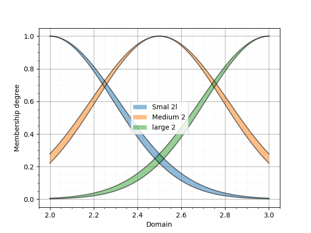

PyIT2FLS
========

.. automodule:: pyit2fls

**PyIT2FLS** is a NumPy- and SciPy-based toolkit designed for working with Type 1 and 
Interval Type 2 Fuzzy Logic Systems.
   
The toolkit is distributed under the MIT License. If you use PyIT2FLS in your work, 
please cite the preprint of our paper, PyIT2FLS: A New Python Toolkit for Interval 
Type 2 Fuzzy Logic Systems.

BibTeX:

.. code-block:: Bibtex

    @misc{haghrah2019pyit2fls,
        title={PyIT2FLS: A New Python Toolkit for Interval Type 2 Fuzzy Logic Systems},
        author={Amir Arslan Haghrah and Sehraneh Ghaemi},
        year={2019},
        eprint={1909.10051},
        archivePrefix={arXiv},
        primaryClass={eess.SY}
    }

MLA:

.. code-block:: markdown

    Haghrah, Amir Arslan, and Sehraneh Ghaemi. "PyIT2FLS: A New Python Toolkit for Interval Type 2 Fuzzy Logic Systems." arXiv preprint arXiv:1909.10051 (2019).

Installation
------------

PyIT2FLS can be installed using one of the following methods:

From Source
^^^^^^^^^^^

Download and unzip the source code into a directory. Then, 
navigate to the PyIT2FLS folder and run the following command:

.. code-block:: shell

    pip3 install .

Using PyPI
^^^^^^^^^^

Alternatively, you can install or upgrade PyIT2FLS directly from PyPI using:

.. code-block:: shell

    pip3 install --upgrade pyit2fls

Support My Work with Tether (USDT)
----------------------------------

If you find this Python library useful and would like to support its development, 
donations are greatly appreciated. To donate USDT, please send to the following 
wallet address: 0x2c0fb11b56b10b5ddda6a8c9c1f6d0b559153de2. Ensure you select 
the Avalanche C-Chain network when making the transaction. Using the wrong network, 
such as Ethereum, may result in lost funds.

Thank you for your contribution, which helps maintain and improve this project!

Getting Started
---------------

This section introduces basic examples of how to use the PyIT2FLS library. For more 
advanced use cases, please refer to the examples directory in the PyIT2FLS github 
repository. 

Example 1: Defining Type 1 Fuzzy Sets and Performing AND/OR Operators on Them
^^^^^^^^^^^^^^^^^^^^^^^^^^^^^^^^^^^^^^^^^^^^^^^^^^^^^^^^^^^^^^^^^^^^^^^^^^^^^

In this example, we define two trapezoidal Type 1 fuzzy sets and apply fuzzy AND and OR 
operators on them. First, we create the trapezoidal fuzzy sets using the *T1FS* class and 
the *trapezoid_mf* function. Then, we plot the fuzzy sets together using the *T1FS_plot* 
function:

.. code-block:: python

    from pyit2fls import (T1FS, trapezoid_mf, T1FS_plot, )
    from numpy import linspace

    domain = linspace(-1.5, 1.5, 100)
    set1 = T1FS(domain, trapezoid_mf, [-1.25, -0.75, -0.25, 0.25, 1.])
    set2 = T1FS(domain, trapezoid_mf, [-0.25, 0.25, 0.75, 1.25, 1.])
    T1FS_plot(set1, set2, legends=["Trapezoidal Set 1", "Trapezoidal Set 2", ])

The output of this code is shown below:

Next, we compute the AND of these two sets using two different T-norms:

.. code-block:: python

    from pyit2fls import (min_t_norm, product_t_norm, T1FS_AND, )

    set3 = T1FS_AND(domain, set1, set2, min_t_norm)
    set4 = T1FS_AND(domain, set1, set2, product_t_norm)
    T1FS_plot(set3, set4, legends=["Fuzzy Set 3", "Fuzzy Set 4", ])

The output of this code is shown below:

Finally, we compute the OR of these two sets using two different S-norms:

.. code-block:: python

    from pyit2fls import (max_s_norm, probabilistic_sum_s_norm, T1FS_OR, )

    set5 = T1FS_OR(domain, set1, set2, max_s_norm)
    set6 = T1FS_OR(domain, set1, set2, probabilistic_sum_s_norm)
    T1FS_plot(set5, set6, legends=["Fuzzy Set 5", "Fuzzy Set 6", ])

The output of this code is shown below:

Example 2: Defining Type 1 TSK Fuzzy Systems
^^^^^^^^^^^^^^^^^^^^^^^^^^^^^^^^^^^^^^^^^^^^

In this example, we define a simple Type 1 TSK fuzzy system, calculate its output 
for specific inputs, and plot its control surface. First, we define the *T1FS* objects 
representing the inputs of the fuzzy system.

.. code-block:: python

    from pyit2fls import (T1TSK, T1FS, gaussian_mf, T1FS_plot, )
    from numpy import (linspace, meshgrid, zeros, )
    from mpl_toolkits import mplot3d
    import matplotlib.pyplot as plt
    from matplotlib import cm
    from matplotlib.ticker import (LinearLocator, FormatStrFormatter, )

    domain = linspace(-1.5, 1.5, 100)
    t1fs1 = T1FS(domain, gaussian_mf, [-0.5, 0.5, 1.])
    t1fs2 = T1FS(domain, gaussian_mf, [ 0.5, 0.5, 1.])
    T1FS_plot(t1fs1, t1fs2, legends=["Gaussian Set 1", "Gaussian Set 2", ])

The output of this code is shown below:

As shown, there are two Gaussian fuzzy sets. The parameters of a Gaussian membership 
function are the mean, standard deviation, and height, respectively. Next, we define 
the *T1TSK* system along with its input and output variables.

.. code-block:: python

    myT1TSK = T1TSK()
    myT1TSK.add_input_variable("X1")
    myT1TSK.add_input_variable("X2")

    myT1TSK.add_output_variable("Y")

Next, we define the outputs of the fuzzy rules. These outputs must be functions of 
the inputs. Since our myT1TSK system has two inputs, each output function must also 
depend on two inputs. Let's assume the system includes four rules.

.. code-block:: python

    def Y1(X1, X2):
        return 2. * X1 + 3. * X2

    def Y2(X1, X2):
        return -1.5 * X1 + 2. * X2

    def Y3(X1, X2):
        return -2. * X1 - 1.2 * X2

    def Y4(X1, X2):
        return 5. * X1 - 2.5 * X2

After defining the output functions, we define the rules using the following rule base:

+-----------------+----------------+-----------------+
|                 | **X2**: t1fs1  | **X2**: t1fs2   |
+-----------------+----------------+-----------------+
| **X1**: t1fs1   | **Y**: Y1      | **Y**: Y2       |
+-----------------+----------------+-----------------+
| **X1**: t1fs2   | **Y**: Y3      | **Y**: Y4       |
+-----------------+----------------+-----------------+

.. code-block:: python

    myT1TSK.add_rule([("X1", t1fs1), ("X2", t1fs1)], 
                [("Y", Y1), ])
    myT1TSK.add_rule([("X1", t1fs1), ("X2", t1fs2)], 
                [("Y", Y2), ])
    myT1TSK.add_rule([("X1", t1fs2), ("X2", t1fs1)], 
                [("Y", Y3), ])
    myT1TSK.add_rule([("X1", t1fs2), ("X2", t1fs2)], 
                [("Y", Y4), ])

Now, it is time to evaluate the system's output for various points in the universe of 
discourse and plot the control surface:

.. code-block:: python

    X1, X2 = meshgrid(domain, domain)
    O = zeros(shape=X1.shape)

    for i, x1 in zip(range(len(domain)), domain):
        for j, x2 in zip(range(len(domain)), domain):
            o = myT1TSK.evaluate({"X1":x1, "X2":x2}, params=(x1, x2))
            O[i, j] = o["Y"]

    fig = plt.figure()
    ax = fig.add_subplot(111, projection="3d")
    surf = ax.plot_surface(X1, X2, O, cmap=cm.coolwarm,
                        linewidth=0, antialiased=False)
    ax.zaxis.set_major_locator(LinearLocator(10))
    ax.zaxis.set_major_formatter(FormatStrFormatter('%.02f'))
    fig.colorbar(surf, shrink=0.5, aspect=5)
    plt.show()

Finally, the output of this code is shown below:

Example 3: Defining Type 1 Mamdani Fuzzy Systems
^^^^^^^^^^^^^^^^^^^^^^^^^^^^^^^^^^^^^^^^^^^^^^^^

In this example, we define a simple Type 1 Mamdani fuzzy system using PyIT2FLS. We calculate 
its output for specific inputs and plot the corresponding control surface. First, we define 
the *T1FS* objects representing the inputs of the fuzzy system.

.. code-block:: python

    from pyit2fls import (T1Mamdani, T1FS, gaussian_mf, T1FS_plot, )
    from numpy import (linspace, meshgrid, zeros, )
    from mpl_toolkits import mplot3d
    import matplotlib.pyplot as plt
    from matplotlib import cm
    from matplotlib.ticker import (LinearLocator, FormatStrFormatter, )

    inputDomain = linspace(-1.5, 1.5, 100)
    t1fs1 = T1FS(inputDomain, gaussian_mf, [-0.5, 0.5, 1.])
    t1fs2 = T1FS(inputDomain, gaussian_mf, [ 0.5, 0.5, 1.])
    T1FS_plot(t1fs1, t1fs2, legends=["Gaussian Set 1", "Gaussian Set 2", ])

The output of this code is shown below:

.. image:: ../_static/Figure_6.png
   :alt: Defining two fuzzy sets representing the inputs of the fuzzy system.
   :width: 400px
   :align: center

As shown, there are two Gaussian fuzzy sets describing the input variables. Next, 
we define the *T1FS* objects representing the outputs of the fuzzy system.

.. code-block:: python

    outputDomain = linspace(-10., 10., 1000)
    t1fs3 = T1FS(outputDomain, gaussian_mf, [-7.5, 2.0, 1.])
    t1fs4 = T1FS(outputDomain, gaussian_mf, [-2.5, 2.0, 1.])
    t1fs5 = T1FS(outputDomain, gaussian_mf, [ 2.5, 2.0, 1.])
    t1fs6 = T1FS(outputDomain, gaussian_mf, [ 7.5, 2.0, 1.])
    T1FS_plot(t1fs3, t1fs4, t1fs5, t1fs6, 
              legends=["Gaussian Set 3", "Gaussian Set 4", 
                       "Gaussian Set 5", "Gaussian Set 6", ])

In this step, we define four sets. For all possible fuzzy rules, we can assign a 
distinct output. The output *T1FS* objects are as follows:

Now, it is time to define the Type 1 Mamdani system along with its input and output 
variables. The inference engine and defuzzification method can be chosen from several 
well-known options (refer to the documentation for more details). In this example, we 
use the "Product" inference engine and the center of gravity ("CoG") defuzzification 
method. Additionally, we name the inputs "X1" and "X2" and the output "Y."

.. code-block:: python

    myT1Mamdani = T1Mamdani(engine="Product", defuzzification="CoG")
    myT1Mamdani.add_input_variable("X1")
    myT1Mamdani.add_input_variable("X2")

    myT1Mamdani.add_output_variable("Y")

After defining the *T1Mamdani* system, the next step is to define the rule base for the 
fuzzy system. The rules shown in the following table will be used to construct the rule 
base.

+-----------------+-------------------+--------------------+
|                 | **X2**: t1fs1     | **X2**: t1fs2      |
+-----------------+-------------------+--------------------+
| **X1**: t1fs1   | **Y**: t1fs3      | **Y**: t1fs4       |
+-----------------+-------------------+--------------------+
| **X1**: t1fs2   | **Y**: t1fs5      | **Y**: t1fs6       |
+-----------------+-------------------+--------------------+

The code to add rules to the rule base is as follows:

.. code-block:: python

    myT1Mamdani.add_rule([("X1", t1fs1), ("X2", t1fs1)], [("Y", t1fs3), ])
    myT1Mamdani.add_rule([("X1", t1fs1), ("X2", t1fs2)], [("Y", t1fs4), ])
    myT1Mamdani.add_rule([("X1", t1fs2), ("X2", t1fs1)], [("Y", t1fs5), ])
    myT1Mamdani.add_rule([("X1", t1fs2), ("X2", t1fs2)], [("Y", t1fs6), ])

Finally, it is time to evaluate the system's output for various points in the universe 
of discourse and plot the control surface:

.. code-block:: python

    X1, X2 = meshgrid(inputDomain, inputDomain)
    O = zeros(shape=X1.shape)

    for i, x1 in zip(range(len(inputDomain)), inputDomain):
        for j, x2 in zip(range(len(inputDomain)), inputDomain):
            s, c = myT1Mamdani.evaluate({"X1":x1, "X2":x2})
            O[i, j] = c["Y"]

    fig = plt.figure()
    ax = fig.add_subplot(111, projection="3d")
    surf = ax.plot_surface(X1, X2, O, cmap=cm.coolwarm,
                        linewidth=0, antialiased=False)
    ax.zaxis.set_major_locator(LinearLocator(10))
    ax.zaxis.set_major_formatter(FormatStrFormatter('%.02f'))
    fig.colorbar(surf, shrink=0.5, aspect=5)
    plt.show()

And the output of this code is shown below:

Example 4: Defining Interval Type 2 Fuzzy Sets
^^^^^^^^^^^^^^^^^^^^^^^^^^^^^^^^^^^^^^^^^^^^^^

In this example, we define and plot ten well-known types of interval Type 2 fuzzy sets. 
Before using the IT2FS class, we perform some initial imports and define the universe 
of discourse.

The IT2FS class requires five parameters to create an interval Type 2 fuzzy set:

1. **Domain**: The universe of discourse.
2. **Upper membership function**: A function defining the upper bound.
3. **Parameters of the upper membership function**: The parameters required by the upper membership function.
4. **Lower membership function**: A function defining the lower bound.
5. **Parameters of the lower membership function**: The parameters required by the lower membership function.

.. code-block:: python

    from pyit2fls import (IT2FS, tri_mf, const_mf, rtri_mf, ltri_mf, 
                        trapezoid_mf, gaussian_mf, IT2FS_Gaussian_UncertMean, 
                        IT2FS_Gaussian_UncertStd, R_IT2FS_Gaussian_UncertStd, 
                        L_IT2FS_Gaussian_UncertStd, IT2FS_plot, )
    from numpy import linspace

    domain = linspace(0, 4, 1001)

The first *IT2FS* we define is the constant interval Type 2 fuzzy set. This set requires 
only the UMF and LMF as constant membership functions. The constant membership function 
has a single parameter: its value.

The *check_set* option, when defining an *IT2FS*, can be used for debugging purposes. 
Sometimes, errors in the fuzzy set parameters can cause the LMF to have a greater 
membership degree than the UMF at certain points in the universe of discourse. If 
*check_set* is set to *True*, an exception will be raised in such cases.

.. code-block:: python

    Const = IT2FS(domain, const_mf, [1.0], const_mf, [0.9], check_set=True)

The next *IT2FS* is the triangular interval Type 2 fuzzy set. It uses triangular membership 
functions for both the UMF and LMF. The parameters for a triangular membership function, 
defined by *tri_mf*, include the left, center, and right points, as well as the height of 
the triangle.

.. code-block:: python

    Tri = IT2FS(domain, tri_mf, [0.7, 1.0, 1.3, 0.3], tri_mf, [0.8, 1.0, 1.2, 0.2], check_set=True)

We can also define left and right triangular interval Type 2 fuzzy sets using the *rtri_mf* 
and *ltri_mf* functions. The parameters required for *rtri_mf* are the right, center, and height. 
Similarly, for *ltri_mf*, the parameters are the left, center, and height.

.. code-block:: python

    RTri = IT2FS(domain, rtri_mf, [1.85, 1.25, 0.8], rtri_mf, [1.75, 1.15, 0.8], check_set=True)
    LTri = IT2FS(domain, ltri_mf, [0.15, 0.75, 0.7], ltri_mf, [0.25, 0.85, 0.7], check_set=True)

The next well-known interval Type 2 fuzzy set is the trapezoidal set. We can define it 
using the trapezoidal membership function, *trapezoid_mf*. It has five parameters: left, 
left-center, right-center, right, and height.

.. code-block:: python

    Trapezoid = IT2FS(domain, 
                    trapezoid_mf, [0.45, 0.85, 1.15, 1.55, 0.5], 
                    trapezoid_mf, [0.55, 0.95, 1.05, 1.45, 0.45], 
                    check_set=True)

We can also define Gaussian-type sets, including general Gaussian sets, Gaussian sets 
with uncertain mean values, and Gaussian sets with uncertain standard deviation values. 
As a general form, Gaussian sets can be defined using the *IT2FS* class and the 
*gaussian_mf* function. The parameters for *gaussian_mf* are the mean value, standard 
deviation, and height.

Defining Gaussian sets with uncertain mean values and Gaussian sets with uncertain 
standard deviation values is simplified by the functions *IT2FS_Gaussian_UncertMean* and 
*IT2FS_Gaussian_UncertStd*. The inputs to *IT2FS_Gaussian_UncertMean* are the domain 
and a list of parameters, which include the mean center, mean spread, standard 
deviation, and height. For *IT2FS_Gaussian_UncertStd*, the inputs are similar, but 
the parameters list consists of the mean, standard deviation center, standard deviation 
spread, and height.

.. code-block:: python

    Gaussian = IT2FS(domain, 
                     gaussian_mf, [2.25, 0.1, 0.5], 
                     gaussian_mf, [2.25, 0.05, 0.4], 
                     check_set=True)
    Gaussian_UncertMean = IT2FS_Gaussian_UncertMean(domain, [2.5, 0.1, 0.1, 0.5])
    Gaussian_UncertStd = IT2FS_Gaussian_UncertStd(domain, [2.75, 0.1, 0.05, 0.5])

There are two other widely used Gaussian-type fuzzy sets in applications, for which 
PyIT2FLS provides specific functions to define them easily: right-sided and left-sided 
Gaussian interval Type 2 fuzzy sets with uncertain standard deviation values. The 
functions for defining these sets are *R_IT2FS_Gaussian_UncertStd* and 
*L_IT2FS_Gaussian_UncertStd*.

The inputs to these functions are the domain and a parameters list. The parameters 
list for both functions should include the mean, standard deviation center, 
standard deviation spread, and height.

.. code-block:: python

    RGaussian_UncertStd = R_IT2FS_Gaussian_UncertStd(domain, [3.25, 0.2, 0.05, 0.6])
    LGaussian_UncertStd = L_IT2FS_Gaussian_UncertStd(domain, [3.75, 0.2, 0.05, 0.6])

Finally, let's plot all of these sets using the *IT2FS_plot* function:

.. code-block:: python

    IT2FS_plot(Const, Tri, RTri, LTri, Trapezoid, Gaussian,
               Gaussian_UncertMean, Gaussian_UncertStd, 
               RGaussian_UncertStd, LGaussian_UncertStd, 
               legends = ["Const Set", 
                          "Triangular Set", 
                          "Right Triangular Set", 
                          "Left Triangular Set", 
                          "Trapezoid", 
                          "Gaussian", 
                          "G. with Uncertain Mean", 
                          "G. with Uncertain Std", 
                          "Right G. with Uncertain Std", 
                          "Left G. with Uncertain Std", ], 
               legendloc="upper right", bbox_to_anchor=(1.55, 1), 
               filename="Figure_9", ext="png"))

The output of this code is shown below:

Example 5. Performing MEET and JOIN Operators on IT2FSs
^^^^^^^^^^^^^^^^^^^^^^^^^^^^^^^^^^^^^^^^^^^^^^^^^^^^^^^

In this example, we define two *IT2FS* s and then calculate their MEET and JOIN operators.

.. code-block:: python

    from pyit2fls import (IT2FS, R_IT2FS_Gaussian_UncertStd, 
                        L_IT2FS_Gaussian_UncertStd, IT2FS_plot, 
                        hamacher_product_t_norm, probabilistic_sum_s_norm, 
                        meet, join, )
    from numpy import linspace

    domain = linspace(1, 2, 1001)

    RGaussian_UncertStd = R_IT2FS_Gaussian_UncertStd(domain, [1.25, 0.2, 0.05, 0.6])
    LGaussian_UncertStd = L_IT2FS_Gaussian_UncertStd(domain, [1.75, 0.2, 0.05, 0.6])

    IT2FS_plot(RGaussian_UncertStd, LGaussian_UncertStd, 
               legends=["IT2FS1", 
                        "IT2FS2", ])

As can be seen, we defined a right and a left Gaussian interval Type 2 fuzzy set 
with uncertain standard deviation values. The output plot of these fuzzy sets 
is shown below:

Now, we will calculate the MEET and JOIN using the two functions *meet* and *join*. The 
first three inputs for both functions are the same: the domain, the first *IT2FS*, and 
the second *IT2FS*. However, the fourth input for meet should be a T-norm, while for 
join, it should be an S-norm.

.. code-block:: python

    MEET = meet(domain, RGaussian_UncertStd, LGaussian_UncertStd, hamacher_product_t_norm)
    JOIN = join(domain, RGaussian_UncertStd, LGaussian_UncertStd, probabilistic_sum_s_norm)
    IT2FS_plot(MEET, JOIN, 
               legends=["MEET", 
                        "JOIN", ])

Using the Hamacher product T-norm and the probabilistic sum S-norm, the resulting output 
sets are shown below:

.. image:: ../_static/Figure_11.png
   :alt: MEET and JOIN of the defined two fuzzy sets.
   :width: 400px
   :align: center

Example 6: Defining Interval Type 2 TSK Fuzzy Systems
^^^^^^^^^^^^^^^^^^^^^^^^^^^^^^^^^^^^^^^^^^^^^^^^^^^^^

In this example, we define a simple interval Type 2 TSK fuzzy system with two inputs 
and one output. Two *IT2FS* s will describe the input variables' universe of discourse, 
and there will be four different outputs corresponding to four rules in the system's 
rule-base. First, we define the fuzzy sets as follows:

.. code-block:: python

    from pyit2fls import (IT2TSK, IT2FS_Gaussian_UncertStd, IT2FS_plot, 
                        product_t_norm, max_s_norm, )
    from mpl_toolkits import mplot3d
    import matplotlib.pyplot as plt
    from matplotlib import cm
    from matplotlib.ticker import LinearLocator, FormatStrFormatter
    from numpy import linspace, meshgrid, zeros

    domain = linspace(0., 1., 100)

    X1, X2 = meshgrid(domain, domain)

    IT2FS1 = IT2FS_Gaussian_UncertStd(domain, [0, 0.2, 0.05, 1.])
    IT2FS2 = IT2FS_Gaussian_UncertStd(domain, [1., 0.2, 0.05, 1.])
    IT2FS_plot(IT2FS1, IT2FS2, title="Sets", 
                legends=["IT2FS1", "IT2FS2"])

The following figure illustrates the defined fuzzy sets:

Next, we define the system using the *IT2TSK* class. The constructor of this class 
accepts two inputs: the T-norm and the S-norm to be used. We then define the names of 
the input and output variables using the *add_input_variable* and *add_output_variable* 
functions for later use. The rules of the system are added with the *add_rule* function, 
which requires two inputs: the antecedent and the consequent, both of which are 
lists of tuples.

Antecedent is a list of tuples where each tuple assigns a variable to an *IT2FS*. The 
first element of each tuple must be the input variable name (as a string), and the 
second element must be an *IT2FS*.

Consequent is a list of tuples where each tuple assigns a variable to an output state. 
The first element of each tuple must be the output variable name (as a string), and 
the second element must be a dictionary. This dictionary represents the output 
polynomial for the rule. For example, if the output polynomial is 2*X1 + 4*X2 + 5, 
the corresponding dictionary would be {"const": 5., "X1": 2., "X2": 4.}. Note that 
this example is for an IT2 TSK FLS with two inputs, named X1 and X2.

The following code demonstrates how to define the *IT2TSK*, define input and output 
variables, and add rules to the rule base of the system.

.. code-block:: python

    myIT2FLS = IT2TSK(product_t_norm, max_s_norm)

    myIT2FLS.add_input_variable("X1")
    myIT2FLS.add_input_variable("X2")
    myIT2FLS.add_output_variable("Y")

    myIT2FLS.add_rule([("X1", IT2FS1), ("X2", IT2FS1)], 
                    [("Y", {"const":1., "X1":1., "X2":1.}), ])
    myIT2FLS.add_rule([("X1", IT2FS1), ("X2", IT2FS2)], 
                    [("Y", {"const":0.5, "X1":1.5, "X2":0.5}), ])
    myIT2FLS.add_rule([("X1", IT2FS2), ("X2", IT2FS1)], 
                    [("Y", {"const":-0.2, "X1":2., "X2":0.1}), ])
    myIT2FLS.add_rule([("X1", IT2FS2), ("X2", IT2FS2)], 
                    [("Y", {"const":-1., "X1":4., "X2":-0.5}), ])

Now, let's evaluate the system's output for different points in the universe of 
discourse to obtain the output surface of the system and plot it.

.. code-block:: python

    O = zeros(shape=X1.shape)

    for i, x1 in zip(range(len(domain)), domain):
        for j, x2 in zip(range(len(domain)), domain):
            o = myIT2FLS.evaluate({"X1":x1, "X2":x2})
            O[i, j] = o["Y"]

    fig = plt.figure()
    ax = fig.add_subplot(111, projection="3d")
    surf = ax.plot_surface(X1, X2, O, cmap=cm.coolwarm,
                        linewidth=0, antialiased=False)
    ax.zaxis.set_major_locator(LinearLocator(10))
    ax.zaxis.set_major_formatter(FormatStrFormatter('%.02f'))
    fig.colorbar(surf, shrink=0.5, aspect=5)
    plt.show()

Finally, the output surface of the system is shown below:

Example 7: Defining Interval Type 2 Mamdani Fuzzy Systems
^^^^^^^^^^^^^^^^^^^^^^^^^^^^^^^^^^^^^^^^^^^^^^^^^^^^^^^^^

In this seventh example, we will create an interval Type 2 Mamdani fuzzy system using 
the *IT2Mamdani* class. The system has two inputs and one output. Each input variable 
is described by three *IT2FS*s in its dedicated universe of discourse. The output of 
the system is described using two *IT2FS* s in its own universe of discourse. First, 
we define the input sets as follows:

.. code-block:: python

    from pyit2fls import IT2Mamdani, IT2FS_Gaussian_UncertStd, IT2FS_plot, \
                        min_t_norm, max_s_norm, crisp
    from numpy import linspace, meshgrid, zeros
    from mpl_toolkits import mplot3d
    import matplotlib.pyplot as plt
    from matplotlib import cm
    from matplotlib.ticker import LinearLocator, FormatStrFormatter

    domain1 = linspace(1., 2., 100)
    domain2 = linspace(2., 3., 100)
    domain3 = linspace(3., 4., 100)

    Small1  = IT2FS_Gaussian_UncertStd(domain1, [1.0, 0.2, 0.025, 1.])
    Small2  = IT2FS_Gaussian_UncertStd(domain2, [2.0, 0.3, 0.025, 1.])
    Medium1 = IT2FS_Gaussian_UncertStd(domain1, [1.5, 0.2, 0.025, 1.])
    Medium2 = IT2FS_Gaussian_UncertStd(domain2, [2.5, 0.3, 0.025, 1.])
    Large1  = IT2FS_Gaussian_UncertStd(domain1, [2.0, 0.2, 0.025, 1.])
    Large2  = IT2FS_Gaussian_UncertStd(domain2, [3.0, 0.3, 0.025, 1.])

    IT2FS_plot(Small1, Medium1, Large1, 
            legends=["Small 1", "Medium 1", "large 1"])
    IT2FS_plot(Small2, Medium2, Large2,
            legends=["Smal 2l", "Medium 2", "large 2"])

Based on this code, the *IT2FS* s describing the first input variable are as follows:

.. image:: ../_static/Figure_14.png
   :alt: Defining interval type 2 fuzzy sets for input X1.
   :width: 400px
   :align: center

and the fuzzy sets for the second input variable are as follows:

Next, we define the output sets as follows:

.. code-block:: python

    Low1  = IT2FS_Gaussian_UncertStd(domain3, [3., 0.3, 0.025, 1.])
    High1 = IT2FS_Gaussian_UncertStd(domain3, [4., 0.3, 0.025, 1.])

    IT2FS_plot(Low1, High1, 
                legends=["Low", "High"])

Which are represented below:

Here’s a refined version of your text:

After defining the required *IT2FS*s, it's time to define the fuzzy system using the 
*IT2Mamdani* class. The *IT2Mamdani* class requires a T-norm and an S-norm as constructor 
parameters. The names of the input and output variables should be predefined using 
the *add_input_variable* and *add_output_variable* functions.

Once the input and output variables are defined, the rule base of the system can 
be established using the *add_rule* function. Similar to *IT2TSK*, the *add_rule* 
function for *IT2Mamdani* accepts two inputs: antecedent and consequent.
Antecedent is a list of tuples, where each tuple represents the assignment of a 
variable to an *IT2FS*. The first element of the tuple must be the input variable 
name as a string, and the second element must be an *IT2FS*.
Consequent is a list of tuples, where each tuple represents the assignment of a 
variable to an *IT2FS*. The first element of the tuple must be the output variable 
name as a string, and the second element must be an *IT2FS*.

.. code-block:: python

    myIT2FLS = IT2Mamdani(min_t_norm, max_s_norm)

    myIT2FLS.add_input_variable("X1")
    myIT2FLS.add_input_variable("X2")

    myIT2FLS.add_output_variable("Y")

    myIT2FLS.add_rule([("X1", Small1),  ("X2", Small2)],  [("Y", Low1),  ])
    myIT2FLS.add_rule([("X1", Small1),  ("X2", Medium2)], [("Y", Low1),  ])
    myIT2FLS.add_rule([("X1", Small1),  ("X2", Large2)],  [("Y", Low1),  ])
    myIT2FLS.add_rule([("X1", Medium1), ("X2", Small2)],  [("Y", Low1),  ])
    myIT2FLS.add_rule([("X1", Medium1), ("X2", Medium2)], [("Y", Low1),  ])
    myIT2FLS.add_rule([("X1", Medium1), ("X2", Large2)],  [("Y", High1), ])
    myIT2FLS.add_rule([("X1", Large1),  ("X2", Small2)],  [("Y", High1), ])
    myIT2FLS.add_rule([("X1", Large1),  ("X2", Medium2)], [("Y", High1), ])
    myIT2FLS.add_rule([("X1", Large1),  ("X2", Large2)],  [("Y", High1), ])

After defining our fuzzy system, it's time to evaluate it over the universe of 
discourse and plot the output surface.

.. code-block:: python

    X1, X2 = meshgrid(domain1, domain2)
    Z1 = zeros(shape=(len(domain1), len(domain2)))
    for i, x1 in zip(range(len(domain1)), domain1):
        for j, x2 in zip(range(len(domain2)), domain2):
            it2out, tr = myIT2FLS.evaluate({"X1":x1, "X2":x2})
            Z1[i, j] = crisp(tr["Y"])

    fig = plt.figure()
    ax = fig.add_subplot(111, projection="3d")
    surf = ax.plot_surface(X1, X2, Z1, cmap=cm.coolwarm,
                        linewidth=0, antialiased=False)
    ax.zaxis.set_major_locator(LinearLocator(10))
    ax.zaxis.set_major_formatter(FormatStrFormatter('%.02f'))
    fig.colorbar(surf, shrink=0.5, aspect=5)
    plt.show()

The output surface of the system is as follows:

Example 8: Learning From Input/Output Data
^^^^^^^^^^^^^^^^^^^^^^^^^^^^^^^^^^^^^^^^^^

In this example, we will train fuzzy models using input/output data. PyIT2FLS provides four types 
of models for this purpose: T1Mamdani_ML, T1TSK_ML, IT2Mamdani_ML, and IT2TSK_ML. First, we will 
create some data based on a mathematical model and then add noise to it. Next, we will fit the 
data using different models and compare their performance. Fuzzy systems are expected to perform 
well when handling noisy and uncertain data. Therefore, we anticipate that the output will closely 
resemble the original mathematical model.

.. code-block:: python

    from pyit2fls import (IT2TSK_ML, IT2FS_Gaussian_UncertMean, 
                         IT2FS_plot, )
    from numpy import (linspace, array, abs, pi, sin, 
                       cos, meshgrid, zeros_like, sum, 
                       column_stack, )
    from numpy.random import (rand, )
    import matplotlib.pyplot as plt
    from mpl_toolkits.mplot3d import Axes3D

    x1 = linspace(-pi, pi, 10)
    x2 = linspace(-pi, pi, 10)

    X1, X2 = meshgrid(x1, x2)

    X = column_stack((X1.ravel(), X2.ravel()))
    y1 = sin(X1) + cos(X2)
    noise = 1.0 * (rand(len(X1), len(X2)) - 0.5)
    y2 = y1 + noise

Now, we will create an *IT2TSK_ML* object with two inputs, four rules, parameters bounded by −π 
and π, interval type-2 Gaussian sets with uncertain mean values, and a genetic algorithm configured 
with a population size of 200, 100 iterations, 500 mutations, 50 combinations, and an elite 
assumption of 2%.

.. code-block:: python

    N = 2
    M = 4
    myIT2TSK = IT2TSK_ML(N, M, IT2FS_Gaussian_UncertMean, (-pi, pi), 
                         algorithm="GA", 
                         algorithm_params=[100, 100, 500, 50, 0.05])

Let's give generated noisy data to the model, for fitting it.

.. code-block:: python

    myIT2TSK.fit(X, y2.ravel())

In this step, we have an interval type-2 TSK system with parameters optimized to minimize the error 
for the input/output dataset. Using the fitted model, we evaluate the output for the input dataset:

.. code-block:: python

    y3 = myIT2TSK.score(X).reshape(X1.shape)

Next, let’s plot the original data, the noisy data, and the fitted data:

.. code-block:: python

    fig = plt.figure(figsize=(6, 4))
    ax = fig.add_subplot(111, projection='3d')
    original = ax.plot_surface(X1, X2, y1, cmap="Blues", 
                               vmin=y1.min(), vmax=y1.max())
    fig.colorbar(original, ax=ax, shrink=0.5, aspect=10, 
                label="Original Surface")
    ax.view_init(elev=10, azim=-60)
    ax.set_xlabel(r"$x_{1}$")
    ax.set_ylabel(r"$x_{2}$")

    plt.tight_layout()
    plt.savefig("example8_1", format="pdf", 
                dpi=600, bbox_inches="tight")
    plt.show()

    fig = plt.figure(figsize=(6, 4))
    ax = fig.add_subplot(111, projection='3d')
    fitted = ax.plot_surface(X1, X2, y2, cmap="Blues", 
                             vmin=y2.min(), vmax=y2.max())
    fig.colorbar(fitted, ax=ax, shrink=0.5, aspect=10, 
                 label="Noisy Surface")
    ax.view_init(elev=10, azim=-60)
    ax.set_xlabel(r"$x_{1}$")
    ax.set_ylabel(r"$x_{2}$")

    plt.tight_layout()
    plt.savefig("example8_2", format="pdf", 
                dpi=600, bbox_inches="tight")
    plt.show()

    fig = plt.figure(figsize=(6, 4))
    ax = fig.add_subplot(111, projection='3d')
    error_surface = ax.plot_surface(X1, X2, abs(y1 - y3), 
                                    cmap="Greens", alpha=0.8)
    fig.colorbar(error_surface, ax=ax, shrink=0.5, aspect=10, 
                label="Error Surface")
    ax.plot_surface(X1, X2, y3, cmap="Blues", alpha=0.7)
    ax.view_init(elev=10, azim=-60)
    ax.set_xlabel(r"$x_{1}$")
    ax.set_ylabel(r"$x_{2}$")

    plt.tight_layout()
    plt.savefig("example8_3", format="pdf", 
                dpi=600, bbox_inches="tight")
    plt.show()

Finally, we will represent the rule base and save it.

.. code-block:: python

    systemData = open("data.txt", "w")

    for i, rule in zip(range(len(myIT2TSK.model.it2tsk.rules)), 
                    myIT2TSK.model.it2tsk.rules):
        IT2FS_plot(rule[0][0][1], rule[0][1][1], title=f"Rule {i+1}", 
                    legends=[r"$X_{1}$", r"$X_{2}$", ], 
                    filename=f"example8_{i+4}", ext="pdf")
        ruleText = f"Rule {i+1}: IF X1 IS [{rule[0][0][1]}] AND X2 IS [{rule[0][1][1]}] THEN Y IS [{rule[1][0][1]['const']}]"
        print(ruleText)
        systemData.write(ruleText + "\n")

    systemData.close()

    print(f"Fitting error with respect to original surface: {sum((y1 - y3) ** 2) ** 0.5}")
    print(f"Fitting error with respect to noisy surface: {sum((y2 - y3) ** 2) ** 0.5}")

The next model to be used is *IT2Mamdani_ML*. ...
